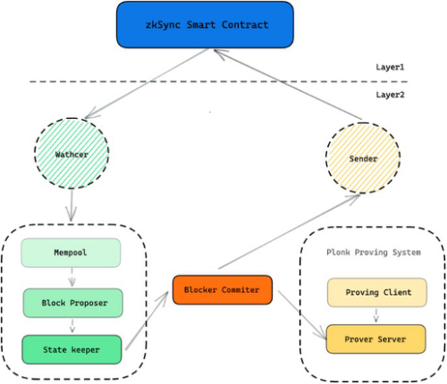

**zkSync的整体架构工作过程**

Watcher 负责监控 zkSync 合约交易，Sender发送 zkSync 智能合约的交易，而 MemPool 负责收集交易。

整个过程会产生两种交易：L1交易和L2交易。

Block Proposer 将交易打包，并更改世界状态( Plasma State )。在世界状态更改后，通过Block Committer 生成证明需要的信息。具体到存款和转账流程如下：

**存款**

1、用户调用 L1 zkSync 智能合约存储资金，该交易发生在 L1；

2、Watcher 监控 L1 存款交易，当交易发生时则会放入 Mempool 中，该过程一般会经过 10个区块确认，但实际使用中，可能需要更长时间 L1 的充币交易才会在 L2 中生效；

3、Block Proposer 处理 Mempool 交易打包，并提交 State Keeper 更新账本，充币交易的状态随之变化。

**转账**

1、当用户想要使用 L2 低成本快速转账时，调用 zkSync API 提交转账交易；

2、交易同样会按照流程 Mempool --> Block Proposer --> State Keeper 进行流转；

3、最终 State Keeper 通知 Block Commiter 收集生成零知识证明所需信息，调用 PlonK 证明系统生成零知识证明后，借助 Sender 将存款和转账等交易数据，以及将对应的零知识证明提交到 L1 的 zkSync 智能合约验证，等待 L1 交易确认后，Watcher 会通知 L2 更新交易状态为最终确认。

zkSync 采用PlonK零知识证明系统，其中包括 Prover Server 和 Proving Client，在电路设计上，非常巧妙的将交易分割成一个个小的通用处理单元（ Operation ）。

一个 Operation 对应的证明电路逻辑支持所有可能交易的 Operation 逻辑。多个有关联的 Operation 电路组成交易电路。

多个交易的电路再组合成区块电路。从而，在固定大小的区块中也能包含不同组合的交易。zkSync 开源了 PlonK 算法的验证电路，能进行多个 PlonK 证明。

相关代码链接如下：

https://github.com/matter-labs/recursive_aggregation_circuit

而在整个充币和转账过程中，zkSync 并不需要独立生成新账户，zkSync 的 L2 账户和 L1 账户是一一对应的，“共享”一份私钥，准确的说，L1 的私钥的 ECDSA 签名的结果作为 L2 账户的私钥。

这样在使用的时候很方便，我们直接使用 L1 的地址就可以在 L2上 完成充币，转账或者提币的操作。