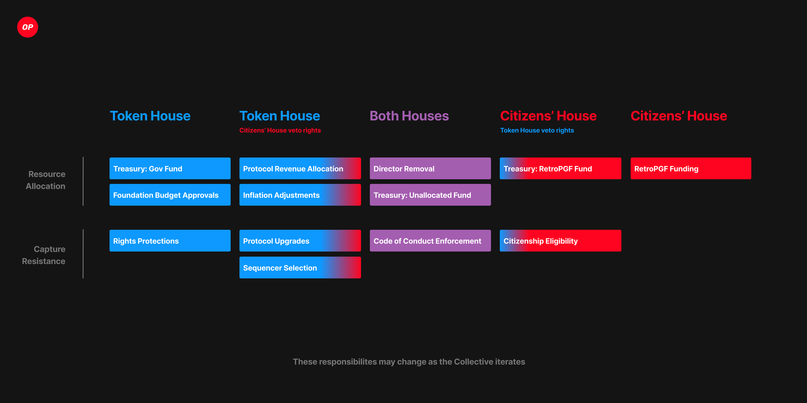

> 请在上边的 timezone 添加你的当地时区，这会有助于你的打卡状态的自动化更新，如果没有添加，默认为北京时间 UTC+8 时区
> 时区请参考以下列表，请移除 # 以后的内容

timezone: Pacific/Honolulu # 夏威夷-阿留申标准时间 (UTC-10)

timezone: America/Anchorage # 阿拉斯加标准时间 (UTC-9)

timezone: America/Los_Angeles # 太平洋标准时间 (UTC-8)

timezone: America/Denver # 山地标准时间 (UTC-7)

timezone: America/Chicago # 中部标准时间 (UTC-6)

timezone: America/New_York # 东部标准时间 (UTC-5)

timezone: America/Halifax # 大西洋标准时间 (UTC-4)

timezone: America/St_Johns # 纽芬兰标准时间 (UTC-3:30)

timezone: America/Sao_Paulo # 巴西利亚时间 (UTC-3)

timezone: Atlantic/Azores # 亚速尔群岛时间 (UTC-1)

timezone: Europe/London # 格林威治标准时间 (UTC+0)

timezone: Europe/Berlin # 中欧标准时间 (UTC+1)

timezone: Europe/Helsinki # 东欧标准时间 (UTC+2)

timezone: Europe/Moscow # 莫斯科标准时间 (UTC+3)

timezone: Asia/Dubai # 海湾标准时间 (UTC+4)

timezone: Asia/Kolkata # 印度标准时间 (UTC+5:30)

timezone: Asia/Dhaka # 孟加拉国标准时间 (UTC+6)

timezone: Asia/Bangkok # 中南半岛时间 (UTC+7)

timezone: Asia/Shanghai # 中国标准时间 (UTC+8)

timezone: Asia/Tokyo # 日本标准时间 (UTC+9)

timezone: Australia/Sydney # 澳大利亚东部标准时间 (UTC+10)

timezone: Pacific/Auckland # 新西兰标准时间 (UTC+12)

---

# StarryDesert

1. 自我介绍

   大家好啊，我是参加过上次Arbitrum的共学的StarryDesert，我想继续我的以太坊知识学习之路

2. 你认为你会完成本次残酷学习吗？

   如果没有意外的话，上次我完成了，这次我也会完成，我会加油的

## Notes

<!-- Content_START -->

### 2025.01.06

笔记内容

#### Optimistic Rollup的本质

- Optimistic Rollup是一种依赖于"父链"安全性的区块链解决方案
- 它不需要自己的共识机制，而是利用父链(在这里是以太坊)的共识机制
- 这种设计可以大幅降低成本同时保持安全性

##### 区块存储机制

- 使用非合约地址(0xff00..0010)在以太坊上存储L2区块
- 采用 **EIP-4844** blobs提交交易
- 使用压缩格式写入以降低成本
- 继承了以太坊的可用性和完整性保证

##### 区块生产特点

- 由单一实体"排序者"(**sequencer**)管理
- 每2秒产生一个区块
- 具有私有交易池(**mempool**)以避免MEV
- 交易提交有两种方式：
  * 直接提交给排序者(成本低但可能被审查)
  * 通过L1提交(称为存款，具有抗审查性)

##### 跨层资产桥接

- 支持L1和L2之间的ETH和代币转移
- 从以太坊到OP Mainnet称为"存款"
- 从OP Mainnet到以太坊称为"提款"，需要经过三个阶段：
  * 初始化提款
  * 提交提款证明
  * 等待质疑期后完成提款

##### 错误证明机制

- 状态承诺在没有直接证明的情况下发布到L1
- 状态提交后有7天的质疑窗口期
- 在质疑期内可以通过"错误证明"(**fault proof**)流程挑战
- 成功的质疑只会影响已发布的状态承诺，不会回滚链本身

#### Optimistic Rollup的创新点和优势：

1. 扩展性优势
- 通过将大部分计算和存储转移到L2，显著提升吞吐量
- 保持与以太坊主网的安全性连接，实现可扩展性和安全性的平衡

2. 成本效益
- 通过数据压缩和批处理降低交易成本
- 继承以太坊的安全性而无需额外的共识成本

3. 兼容性
- 与以太坊完全兼容，支持智能合约
- 开发者可以轻松将以太坊应用迁移到Optimism

4. 安全设计
- 采用乐观验证机制，假设大多数交易都是诚实的
- 通过质疑期和错误证明机制确保安全性
- 继承以太坊的安全属性

5. 创新的跨链桥接
- 设计了安全的跨链通信机制
- 引入了多步骤验证流程增强安全性

**Optimistic Rollup** 的设计充分考虑了扩容性、安全性和去中心化这三个区块链的核心特性，是一个相对平衡的解决方案。虽然存在7天提款期这样的限制，但这是为了确保系统安全性的必要妥协。随着技术的发展，这些限制可能会在未来得到优化。

### 2025.01.08

笔记内容

#### Arbitrum 和 Optimism —— 以太坊扩展方案的异同点

技术架构对比：

- Arbitrum：使用 Arbitrum VM 执行智能合约，采用 Fraud Proof 验证机制
- Optimism：使用 OVM (Optimistic Virtual Machine) 执行智能合约，采用 Fraud Prover 机制

验证机制：

- 两者都采用 Optimistic Rollup 技术
- 主要区别在于验证过程：
  - Arbitrum：所有验证人都可参与投票验证交易
  - Optimism：使用 Sequencer 机制，只有特定验证人可以打包交易

技术创新：

- Arbitrum：
  - 可定制的聚合签名
  - 优化的区块链交互技术
  - 高度优化的虚拟机
- Optimism：
  - OVM 虚拟机对 EVM 的兼容性优化
  - 简化的验证流程

安全机制：

- 两者都使用欺诈式证明（Fraud Proof）
- 核心区别：
  - Arbitrum 的验证更分散化
  - Optimism 的验证更中心化但效率更高

这些技术特点反映了两个项目在扩容方案上的不同侧重点：Arbitrum 更注重去中心化和安全性，而 Optimism 更注重处理效率和兼容性。

### 2025.01.09

笔记内容

#### 引入 Stages — 评估 Rollup 成熟度的框架

##### 框架概述

框架将Rollup分为三个阶段，根据其对“训练轮”的依赖程度进行分类：

1. **阶段0——完全训练轮**：在这个阶段，Rollup由运营者完全控制，但源代码是公开的，允许从第一层（L1）发布的数据中重建状态，以便与提出的状态根进行比较。
2. **阶段1——有限训练轮**：此阶段Rollup由智能合约管理，但仍有一个安全委员会处理潜在的漏洞。此阶段的特点是实施了完全功能的证明系统，欺诈证明提交去中心化，并且用户可以在没有运营者协调的情况下退出。
3. **阶段2——无训练轮**：最终阶段是Rollup由智能合约完全管理，欺诈证明系统是无许可的，用户在不受欢迎的升级事件中有足够的时间退出，安全委员会仅限于处理可在链上裁决的错误。

###### 阶段0要求

1. **项目是否自称为Rollup**：项目必须自我认定为Rollup，以便与其他扩展解决方案区分开来。
2. **第二层（L2）状态根是否发布在第一层（L1）**：发布状态根是Rollup的关键特征，允许进行提现。
3. **项目是否提供L1上的数据可用性（DA）**：确保L1上的数据可用性对于Rollup的安全性和可靠性至关重要。
4. **是否有能够重建Rollup状态的源代码**：Rollup节点软件应能够从L1数据重建L2状态，以增强透明度和信任。

###### 阶段1要求

1. **项目是否使用适当的证明系统**：证明系统用于裁定提出的状态根是否正确。在欺诈证明系统中，允许拒绝无效的证明。
2. **至少有5个外部参与者可以提交欺诈证明**：一个有效的欺诈证明系统需要至少一个诚实的参与者来验证提出的状态根的正确性。
3. **用户是否可以在没有运营者协调的情况下退出**：系统应设计为用户可以独立提现，确保他们始终可以访问和控制自己的资产。
4. **用户在不受欢迎的升级情况下至少有7天的退出时间**：此要求旨在保护用户，使他们有足够的时间在系统进行重大变更时退出。
5. **安全委员会是否正确设置**：安全委员会在系统中作为保障，必须通过多签机制运行，至少有8名参与者，要求50%的共识阈值，且至少一半参与者需为外部人员。

###### 阶段2要求

1. **欺诈证明系统是否无许可**：在这个阶段，欺诈证明系统应完全去中心化，任何人都可以提交欺诈证明。
2. **用户在不受欢迎的升级情况下至少有30天的退出时间**：用户应有至少30天的时间在系统进行重大变更时退出。
3. **安全委员会的权限仅限于处理链上检测到的错误**：安全委员会只能在发生严重错误时介入，确保系统进一步向信任最小化的方向发展。

### 2025.01.10

笔记内容

#### Optimism 代币经济学

##### 核心理念和价值分配机制

Optimism Collective的基本理念是**健康的公共产品能创造繁荣的生态系统**。价值主要通过三个方面产生：

1. **排序器收入**：主要用于资助公共产品
2. **贡献者和建设者获益**：通过回溯性公共产品资助(RetroPGF)
3. **用户和社区成员获益**：通过持续的OP空投和生态系统补助

##### OP代币分配比例

1. **生态系统基金(25%)**
   - 治理基金: 5.4%
   - 合作伙伴基金: 5.4%
   - 种子基金: 5.4%
   - 未分配资金: 8.8%
2. **回溯性公共产品资助(20%)**
   - 通过公民院进行分配
   - 由网络交易费和排序器收入支持
3. **用户空投(19%)**
   - 已完成四轮空投
   - 仍有14%储备用于未来空投
4. **核心贡献者(19%)**
   - 给予早期开发团队
   - 设有锁定期
5. **投资者(17%)**
   - 也称"Sugar Xaddies"
   - 同样设有锁定期

##### 重要的空投历史

1. **空投#1**: 向248,699个地址分配5%代币供应
2. **空投#2**: 向307,965个地址分配约1,174万OP
3. **空投#3**: 向31,870个地址分配约1,941万OP
4. **空投#4**: 向22,998个地址分配约1,034万OP（2024年2月）

##### 代币发行细节

- 初始总供应量：4,294,967,296 OP
- 第一年释放30%的初始代币供应量
- 之后的释放需要通过代币持有者投票决定
- 如果基金会授权的OP支出低于初始供应量的10%，预计会请求额外分配

##### 核心机制：回溯性公共产品资助(RetroPGF)

这是Optimism最重要的创新机制之一：

- 通过季度投票分配资金给提供价值的项目和个人
- 为公共产品项目提供退出流动性
- 创造了早期投资公共产品的市场机会

##### 生态系统价值循环

1. OP区块空间需求产生收入
2. 收入通过公共产品分配回生态系统
3. 公共产品创造价值推动更多区块空间需求
4. 形成可持续的价值创造循环

这个经济模型的独特之处在于它创造了一个可持续的价值循环系统，通过激励公共产品的开发来推动整个生态系统的增长。它不仅仅是一个代币分配方案，而是一个完整的经济生态系统设计。

### 2025.01.11

笔记内容

#### Optimism Collective的愿景与使命

**愿景**：构建一个由公司、社区和公民共同努力，奖励公共产品并为以太坊建立可持续未来的超级链（Superchain）。

**使命**：创建一个所有人受益且无人拥有的互联网，简而言之，即“影响=利润”（Impact=Profit）。通过创建一种新的经济模式，让有益的影响获得回报。

##### Superchain产品愿景

1. **标准化链**：实现去中心化和大规模可组合性。
2. **超级链规模**：最初由15-50条链组成，随着时间推移扩展到1000+条。
3. **治理保障安全**：治理机制保护超级链的安全。
4. **治理促进可持续增长**：治理机制创造一个可持续增长和发展的飞轮效应。

##### 治理概述

Optimism Collective采用实验性和敏捷的治理方法，不断迭代以建立一个经得起时间考验的系统。治理模式包括两个议院：代币议院（Token House）和公民议院（Citizens' House），共同形成一个两院制的治理系统。

##### 代币议院（Token House）

- **功能**：OP代币持有者负责提交、讨论和投票各种治理提案。他们可以直接投票或将投票权委托给他人。
- **职责**：代币议院的职责详见《运营手册》（Operating Manual）。

##### 公民议院（Citizens' House）

- **功能**：基于声誉的一人一票治理实验，负责回溯性公共产品资助（Retro Funding）。
- **回溯性公共产品资助**：奖励对Collective和超级链有正面影响的贡献者，基于过去有用的成果而非未来的不确定性。

##### 两院如何协同工作

代币议院和公民议院共同确保Collective实现其愿景。具体职责分工详见两院责任划分图示：

##### 治理文件

1. **《工作宪法》（Working Constitution）**：制定了Collective的治理条款和原则，2022年4月通过。
2. **《运营手册》（Operating Manual）**：描述了代币议院的当前治理流程，会随着Collective的成长而演变。

##### 去中心化模型

1. **去中心化里程碑工作模型**：展示了主要去中心化里程碑及其依赖关系，以及从一个阶段到下一个阶段需要完成的工作。
2. **决策图工作模型**：展示了Optimism治理的完整决策表面，提供了决策设计的框架。

### 2025.01.12

笔记内容

#### Optimism Collective治理提案流程

##### 操作手册 v0.3.9: 代币议院和公民议院

Optimism Collective由两个议院治理：代币议院（Token House）和公民议院（Citizens’ House）。

在代币议院中，OP持有者负责提交、讨论和投票各种类型的Optimism Collective治理提案。他们可以通过将OP投票权委托给自己的地址直接投票，或者将OP投票权委托给合格的第三方。拥有委托OP投票权的地址称为“代表”。

在公民议院中，Optimism公民负责通过“回溯性公共产品资助”（Retro Funding）分配奖励给公共产品的建设者。参与Retro  Funding  3的徽章持有者（通过AttestationStation智能合约的条目标记）现在是公民。公民身份目前是临时的。公民还负责对升级提案进行否决投票。

所有代币和公民议院的代表都应负责任地行使其权力，并遵守《参与规则》和《Optimist期望》。

##### Optimism治理工具包

当前代币议院治理的主要工具包括：

- **代币议院治理合约**：用于代币议院治理提案的链上投票合约。所有符合条件的治理提案都在此提交投票。
- **Optimism治理门户**：一个前端界面，允许代币议院成员委托和投票其链上的OP。
- **公民议院快照空间**：一个前端界面，允许公民议院成员否决代币议院提案。
- **Optimism论坛**：讨论和审议治理提案的平台。
- **Discord**：用于非正式治理讨论和反馈。
- **Github**：通过该公共github仓库管理补助金（任务请求）。
- **Charmverse**：社区主导的Optimism补助金委员会的家园。

随着治理的演变，这些工具或其使用方法可能会发生变化。例如，未来可能会开发专门用于治理委员会的其他用户界面。目前，投票通过治理合约在链上进行，成功的投票由Optimism Foundation实施和管理（见下文），但这种情况不应永久存在。

##### 提案流程

两个议院通过治理提案进行决策。通过投票过程接受或拒绝提案。任何人都可以向治理提交提案。提案必须是以下列出的有效提案类型之一，并且必须遵循此处描述的投票过程。

##### 投票过程

所有治理提案都经历一个为期三周的周期。

每个“周”从周四19:00 GMT（12:00 PST）开始，到下周三19:00 GMT（12:00 PST）结束。

##### 任务补助金

对代币议院任务请求的申请将由补助金委员会审查和选择。对基金会任务请求的申请将由基金会审查和选择。所有申请应遵循github上每个任务请求中概述的提交流程。

##### 其他提案类型

###### **第一至二周：反馈和审查（Draft）**

所有非补助金提案类型应发布到论坛，供任何Optimism社区成员审查。提案作者应响应代表和公民的反馈。

提案应：

- 作为新讨论线程在治理论坛的适当类别中提交。
- 标题中标记为 **Draft** 。
- 格式和内容应符合标准提案模板。
- 任务请求草案只能由Collective反馈委员会和补助金委员会成员提交，并且必须遵循此处的模板。

在第二周结束前，治理管理员将在论坛创建一个投票周期汇总线程，收集所有符合第三周投票要求的提案。此汇总不包括任务补助金申请，这些申请将由基金会或补助金委员会处理。

对于代币议院中提出的非补助金提案，必须有前100名代表中的四人明确批准才能进入第三周。基金会发起的提案不需要代表批准。代表不能批准自己的提案。代表可以通过在提案讨论线程中粘贴以下评论来表示批准：“我是一个Optimism代表**链接到您的承诺**，拥有足够的投票权，我认为该提案已准备好进入投票。”

对于公民议院中提出的非补助金提案，必须有四名公民明确批准才能进入第三周。基金会发起的提案不需要公民批准。公民不能批准自己的提案。公民可以通过在提案讨论线程中粘贴以下评论来表示批准：“我是一个Optimism公民[链接到您的证明]，我认为该提案已准备好进入投票。”

如果代表或公民批准非补助金提案进入投票，这并不意味着他们支持该提案。它只是表示他们认为提案已准备好进入投票。

在非补助金提案获得所需批准后，提案作者应将提案标题从 **Draft** 更新为 **Final** ，并在第二周最后一天19:00 GMT（12:00  PST）之前将提案链接添加为评论到投票周期汇总线程。提案作者还应在提案线程上添加一条反馈总结评论，以便未来的审阅者了解提案的进展。如果反馈是在论坛外收集的（例如在Discord上），提案作者应包括相关链接。

如果提案作者未获得明确批准或希望获得更多反馈，他们应继续从社区获取反馈，并在下一个投票周期提交更新的提案。

###### 第三周：投票

在第三周，所有公民和代表（包括已自我委托的OP代币持有者）都被邀请对提案进行投票。只有在截止时间前添加到投票周期汇总线程并获得所需批准的非补助金提案才会纳入投票。没有明确批准的提案不会进入投票。

代币议院治理提案的批准条件如下：

- **法定人数**：提案所需的最小OP总投票数，包括弃权票。这里的法定人数以投票期开始时的总可投票OP供应量的百分比衡量。“可投票供应量”是已委托的OP总量，因此可以参与投票。总可投票OP供应量的示意图可在此找到。
- **批准门槛**：提案批准所需的最小OP投票数。每个提案的批准门槛是以赞成票占投票总数的百分比衡量的。这不包括弃权票。

在投票期开始时，将对每个代表的投票权进行快照，投票将在Optimism治理门户进行。

公民议院治理提案的批准条件如下：

- **法定人数**：提案所需的最小公民投票数，包括弃权票。这里的法定人数以每季开始时的公民总数的百分比衡量。
- **批准门槛**：提案批准所需的最小公民投票数。每个提案的批准门槛是以每季开始时的公民总数的百分比衡量的。这不包括弃权票。

公民议院的投票将在公民议院快照空间进行。

根据提案类型，确切的法定人数和批准门槛要求可能有所不同。有关更多信息，请参阅下文的提案类型。

如果非补助金提案提交投票但未通过，则该提案不会执行。如果提案作者希望对被拒绝的提案进行迭代，他们应：

- 在论坛上创建一个新提案线程。
- 包括未通过的第一个提案的链接。
- 明确说明新提案中的更改内容。

##### 否决程序

在发展Collective的双院治理系统的下一步中，公民议院将获得选择性否决权。在第6季，公民议院将能够否决由代币议院批准的协议或治理升级。公民议院将在代币议院投票期之后的一周内有权否决任何已批准的协议升级。否决门槛如下面所述。请注意，否决门槛可能会逐步调整。

如果公民议院否决了代币议院批准的协议升级提案，则该提案将不被视为已批准。

##### 有效提案类型

所有v0.3治理提案必须属于以下类别之一：

- **治理基金**
- **协议或治理者升级**
- **通胀调整**
- **董事罢免**
- **财政拨款**
- **行为准则违规**
- **代表罢免**
- **代表结构解散**
- **权利保护**
- **选举**
- **批准**
- **反思期提案（元治理）**

每种提案类型的提交和批准要求如下。如果未指定特定模板，提案应遵循标准提案模板。未来季节可能会增加其他提案类型。

所有补助金申请由选举产生的补助金委员会或基金会处理。补助金申请应遵循github上每个任务请求中概述的流程。

##### 回溯性公共产品资助

公民议院治理包括回溯性公共产品资助（Retro Funding），其投票和拨款分多个“轮次”进行。在每轮回溯中，公民议院投票以回溯性奖励对Collective和超级链有重大影响的公共产品项目。

回溯轮次按照以下流程运行：

1. **范围确定**：在轮次开始时确定奖励的总体金额和影响范围。
2. **申请创建**：邀请项目在回溯资助申请管理器中创建申请。
3. **申请审查**：审查申请是否符合申请规则。
4. **投票**：收集并统计拥有相应AttestationStation条目的公民的投票。
5. **拨款**：根据公民议院投票的加权平均值，将轮次的总体奖励金额分配给获胜项目。
6. **合规**：基金会将收集项目信息以合法合规地分发补助金（包括完成KYC）。

##### 实施和管理

在所有情况下，Optimism Collective治理应与其《工作宪法》、《参与规则》和《行为准则》的精神以及其乐观愿景一致。Optimism Foundation将如以下所述管理这一过程。

##### 管理

Optimism Foundation将促进本《操作手册》中描述的治理程序，以确保Collective成员能够认真参与治理。此类行政服务可能包括：

- 监督治理提案，以确保其有效提交和投票；
- 删除合理认为是欺诈、垃圾信息、诽谤、仇恨或其他不适当或与Collective价值观不一致的提案；
- 监控投票、投票权、可投票代币供应量和投票期，以确定是否达到或准确反映法定人数和批准门槛；
- 管理同时或接近同时提交的相互矛盾的提案；
- 管理网络维护，如紧急漏洞修复或版本回滚（有或没有治理投票）；以及
- 基金会认为与上述相关的其他事项。

##### 实施

通过的治理提案将由Optimism Foundation实施。

收到通过的提案后，Optimism Foundation将确定提案是否安全、可靠、符合基金会和Collective的目的，并能够以合法合规的方式实施（包括完成KYC）。

- 如果是，基金会将以商业上合理的方式尽力实施提案。
- 如果不是，基金会可能会重新提交提案或在其酌情权下实施提案，并附上说明为什么提案被拒绝或限制。

Optimism Foundation将以逐步去中心化其角色的方式进行这些行政工作。

##### 变更流程

本《操作手册》中描述的程序将在GitHub上发布时生效。手册的主要版本将与一系列治理实验（“季节”）相关联。这些变化包括但不限于扩展公民议院，以及添加、删除和修改提案类型和投票过程的规则。任何非文书性更新将反映在本文档顶部的新版本号中，届时更新版本将生效。

##### 流程简要说明

- 提案在三周的投票周期内进行审查。
- 如果您提交的是补助金申请，您需要按照github上每个任务请求中概述的流程提交申请。
- 对于其他提案类型，您可以基于此模板起草提案，并在论坛上以[Draft]为标题发布以获取反馈。代表和/或公民将在论坛上对您的提案提供反馈。使用您的判断力来整合反馈。
- 一旦您的非补助金提案获得前100名代表或四名公民的批准，请在第二周的最后一天之前将提案链接添加到投票周期汇总线程，并将标题从[Draft]更新为[Final]。这些提案将进入第三周投票。基金会发起的提案不需要批准。
- 代币议院批准的协议或治理者升级提案，必须通过公民议院的否决程序（如上文否决程序部分所述），才能被正式批准。
- 安全委员会将实施正式批准的协议或治理者升级。Optimism Foundation将促进所有其他通过提案的管理，包括分发任何批准的OP补助金。基金会将与您联系，以收集您的项目的额外信息，以执行提案或补助金，包括完成KYC。
- 如果您的提案通过，Optimism Foundation将促进其管理，包括分发任何批准的OP补助金。基金会将与您联系，以收集您的项目的额外信息，以执行提案或补助金，包括完成KYC。
- 如果您的提案未通过，您可以在下一个周期中提交新的提案，说明您在第一个提案中进行了哪些重大更改。

##### 回溯性公共产品资助

公民议院还管理回溯资助的分配：

- 公民身份目前是临时的，回溯资助3的公民通过AttestationStation的条目记录。
- 回溯资助轮次按照预定义的流程进行，目前包括范围确定、申请创建、申请审查、投票和拨款阶段。基金会将收集项目信息以分发补助金，包括完成KYC。

<!-- Content_END -->
