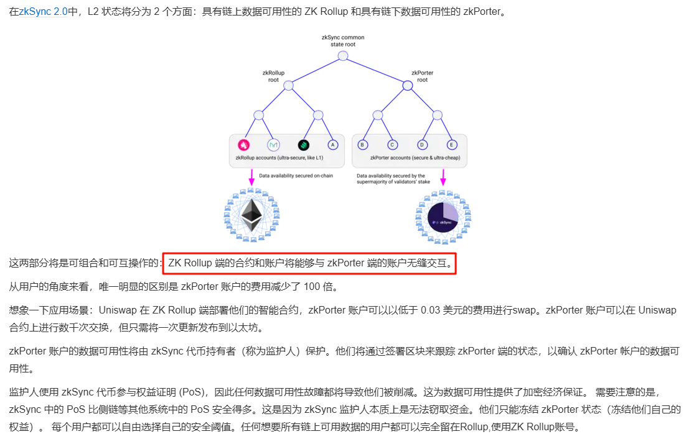
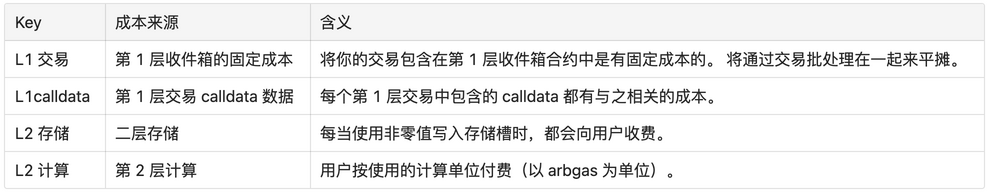
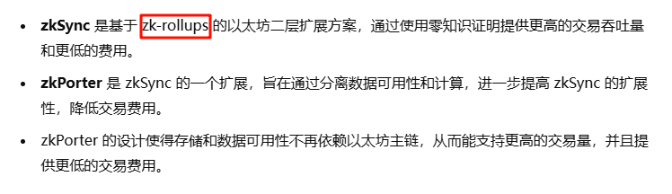
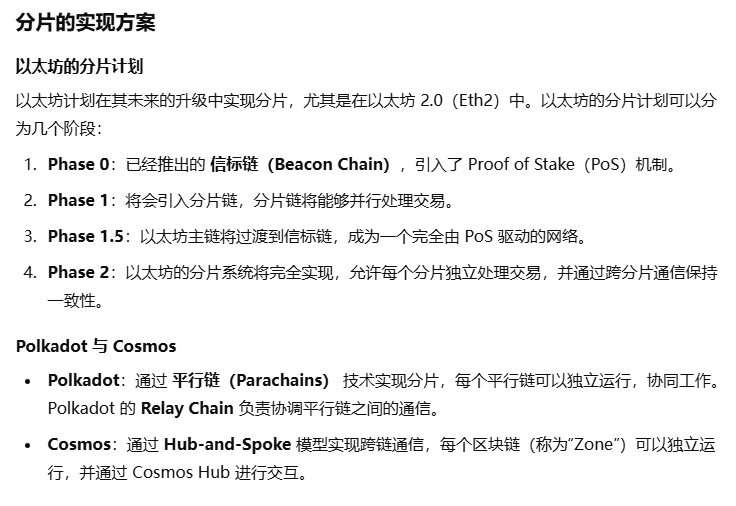
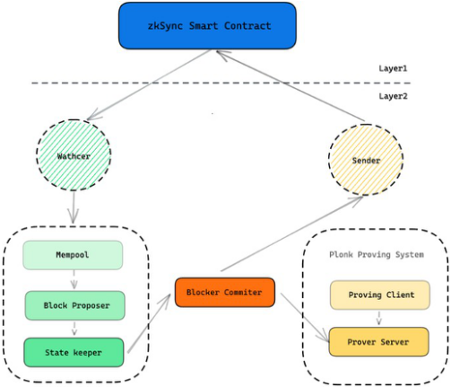
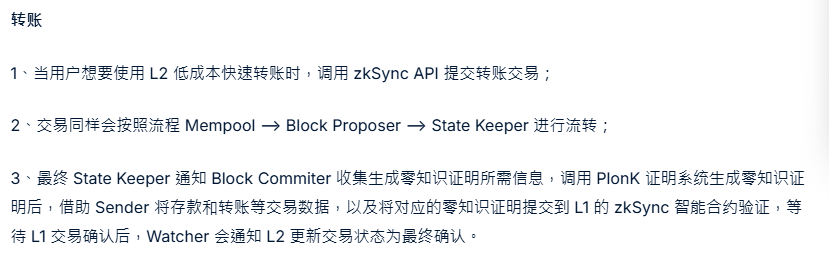
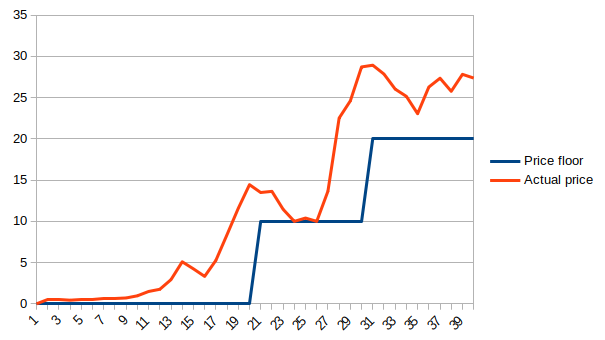
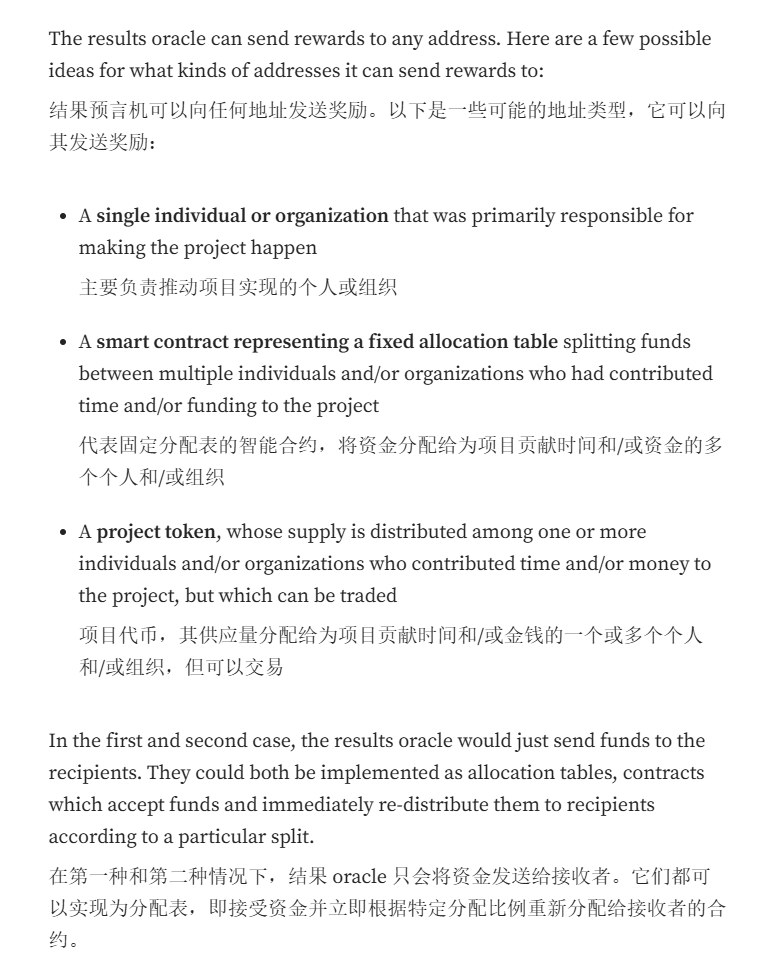
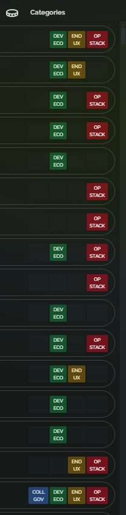
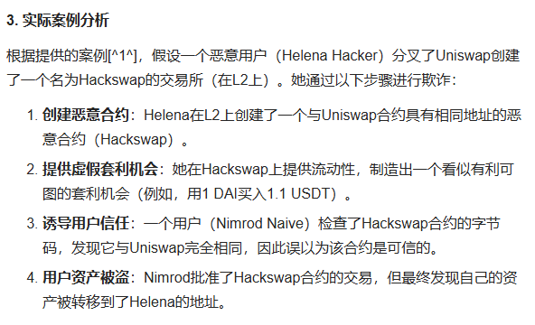

> 请在上边的 timezone 添加你的当地时区，这会有助于你的打卡状态的自动化更新，如果没有添加，默认为北京时间 UTC+8 时区
> 时区请参考以下列表，请移除 # 以后的内容

---

# ATON

1. 自我介绍--web3新人 我要找web3工作！！！！！！！！！

2. 你认为你会完成本次残酷学习吗？--absolutly

## Notes

<!-- Content_START -->

### 2025.01.06

======================================

**Optimism是什么？**

https://www.youtube.com/watch?v=fHkgFu3NLmY&ab_channel=Exodus

基于ETH网络的（Layer2）为降低gas提高效率产品

rollup 将多比交易一起处理为单笔eth交易。

ai大致了解一下

> ### Layer 2 扩容方案
>
> - **定义**：Layer 2 是指在以太坊主链（Layer 1）之上构建的第二层协议，用于处理交易和智能合约的执行，从而减轻 Layer 1 的负担。
> - **目的**：通过在 Layer 2 上进行大部分计算和存储，减少 Layer 1 的交易数量和复杂性，从而实现更高的吞吐量和更低的费用。
>
> ### Optimistic Rollups
>
> - **基本原理**：Optimistic Rollups 是一种 Layer 2 扩容技术，它假设交易是有效的，除非有人提出异议。交易数据和执行结果会被压缩并提交到 Layer 1，而具体的执行过程则在 Layer 2 上进行。
> - 优点
>   - **高吞吐量**：可以在 Layer 2 上处理大量交易，然后将结果批量提交到 Layer 1。
>   - **低交易费用**：由于大部分计算和存储在 Layer 2 上完成，Layer 1 的费用显著降低。
>   - **兼容性**：与以太坊的 EVM 兼容，允许现有的以太坊应用和智能合约在 Layer 2 上运行。
>
> ### Tokenomics
>
> - **OP 代币**：Optimism 的原生代币是 OP，用于激励网络参与者，如验证者和开发者。
> - **用途**：OP 代币可用于治理投票、参与网络的维护和奖励贡献者等。
>
> ### 阶段（Stages）
>
> - **介绍**：Optimism 的发展分为多个阶段，每个阶段代表了技术进步和生态系统的成熟度。
> - **目的**：通过分阶段的迭代，逐步完善 Optimistic Rollups 技术和生态系统，确保安全性和可靠性。

optimism是基于layer1的他是怎样的存在形式 一个智能合约吗？

> Optimism 不是一个单独的智能合约，而是由一组智能合约以及与以太坊主网交互的外部系统组成的。 
>
> 什么外部系统？
>
> 就是指类似于eth的链结构，及其代码中的组件：sequencer verifier state_sync bridgeInfrastructure client
>
> 可以直接和l1上的op相关合约交互来实现op链上的交互

rollup就是指op把他链上的交易做一个打包 然后糅合成一笔交易发送并保存在eth啊网络上吗？

> 是的，**Rollup**（尤其是 **Optimistic Rollup**，如 Optimism）就是指将 **Layer 2**（例如 Optimism）上的交易批量打包，合并成一笔交易，然后将这个交易或状态根提交到 **Layer 1（以太坊）** 网络上进行记录和验证。简而言之，Rollup 通过将多个交易“打包”来提高吞吐量，减少费用，同时仍然保持以太坊主网的安全性。

**主网怎么验证op数据包的正确性的**

> op发送状态根给主网上的智能合约，**这个状态根是 hash[旧状态根+新状态(合约/账户)]** 计算得到的。主网上合约可以验证op状态根的正确性，然后等待挑战期。过后主网上合约就会保存这个有效的状态根，从而保障op的数据可用性DA。主网账户不会保存op链上的具体账户数据。

**怎么发起挑战**

> 如果某个节点或用户认为状态根是错误的（例如通过不合法的交易或状态更新），他们可以在挑战期内 **发起挑战**。挑战需要提供 **欺诈证明**（Fraud Proof），这通常是一个证明，展示如何从当前的状态根回溯到一个不合法的状态或交易。
>
> 这个 **欺诈证明** 可能包括：
>
> - **Merkle Proof**：证明特定交易或账户状态变更是非法的。
> - **交易链**：通过一系列合法的或非法的交易链来展示如何从原状态根到新的状态根之间存在不一致。
>
> **挑战成功的奖励**：如果你成功挑战了不合法的状态根，通常会获得奖励。这可能包括 **ETH** 或其他原生代币，奖励的分配是为了激励节点或用户参与网络的安全验证。
>
> **恶意行为的惩罚**：如果一个节点被证明提交了非法的状态根，可能会受到 **经济惩罚**，例如，损失部分押金或被暂时或永久禁止参与网络操作。

### 2025.01.07

任务：

1. **Stage**
2. Tokenomic
3. **EIP4844**

#### stage

stage简单看来就是对于Rollup系统的一个评估体系。

那三阶段分别是什么？

> 第0阶段：作者自娱自乐级。我开发了一个rollup链，我要开源一个“挖矿软件”让别人也能共同维护链上（状态根）。
>
> 第1阶段：我把软件的功能转移到智能合约上，就比如说状态根的验证这个环节，不再是在各个节点本地验证了，转而用智能合约。同时保留了安全委员会维护bug。注意需要有完整的验证,欺诈证明,退出机制且不受安全委员会干扰。
>
> 第2阶段：rollup完全由合约控制，充足的推出时间（对于不想升级软件的节点），安全委员会仅解决链上裁决的正确性错误，用户免受治理攻击。

那op属于哪一个？

> stage1 https://www.tradingview.com/news/cointelegraph:124d04da9094b:0-optimism-reaches-stage-1-decentralization-implementing-fault-proofs/

#### tokenomic

**1. OP 代币的主要用途**

OP 代币在 Optimism 网络中的主要用途包括：

- **治理**：OP 代币持有者可以参与 Optimism 网络的治理。通过投票，社区成员可以决定关于网络升级、协议改进、资金分配等重要事项。
- **激励**：为了激励网络中的参与者，OP 代币会用于奖励验证节点、开发者和用户。
- **费用支付**：OP 代币用于支付网络中的交易费用。

**2. OP 代币的分配**

OP 代币的初始分配计划如下：

- **空投（Airdrop）**：OP 代币通过空投的方式分发给早期用户，旨在激励社区参与，并帮助更广泛的用户了解和使用 Optimism。
- **社区奖励**：一部分 OP 代币会分配给社区成员作为激励措施，激励他们参与 Optimism 的治理和网络安全等活动。
- **团队和合作伙伴**：一部分 OP 代币会分配给 Optimism 的创始团队、投资者和合作伙伴。
- **DAO资金池**：Opitmism 将建立一个去中心化自治组织（DAO），其资金池用于资助网络的持续发展和其他生态系统的支持。

**3. 治理机制**

Optimism 的治理机制是基于 **Optimism Collective**，这是一个由代币持有者和项目参与者共同治理的机制。具体治理过程如下：

- **OP 代币持有者**：通过持有 OP 代币，用户可以对提案进行投票，决策包括协议升级、资金分配、奖励机制等。

- 治理的两阶段流程

  ：

  - **意向阶段（Idea Phase）**：社区成员提出改进提案，并进行讨论。
  - **决策阶段（Decision Phase）**：最终的治理提案将在 DAO 里进行投票，所有 OP 持有者都有参与权。

**4. 经济激励**

OP 代币的经济激励设计包括：

- **L2 网络安全**：为了确保 Optimism 的安全，验证者和节点运营商需要提供质押的 OP 代币作为担保。任何恶意行为或欺诈行为将导致质押的 OP 代币被扣除。
- **奖励机制**：参与 Optimism 网络的开发者、社区成员、以及其他网络提供者将根据他们的贡献（如代码贡献、开发 dApp、参与治理等）获得 OP 代币奖励。

**5. 代币的通胀机制**

- 激励分配

  ：OP 代币的分配并非一次性完成，而是采取 

  逐步释放

   的方式，以确保代币的供应能根据网络的需求逐渐增加。激励措施包括：

  - 每年一定数量的 OP 代币会释放给参与网络治理、开发和维护的社区成员。
  - 部分 OP 代币将作为奖励发放给网络节点和安全参与者，确保网络的持续运作和安全。

**6. 长期目标和去中心化进程**

Optimism 希望通过以下措施逐步实现全面去中心化：

- **更多参与**：OP 代币的治理机制将逐步增强社区的参与度，确保更多的用户、开发者和节点有机会对网络进行治理。
- **去中心化开发**：随着网络的发展，更多的开发者和第三方应用将能够在 Optimism 上进行部署，进一步推动其生态系统的发展。
- **逐步减少中心化控制**：通过 DAO 机制，Optimism 将逐步减少对中心化控制的依赖，确保协议的完全去中心化。

**7. 持续发展与生态建设**

Optimism 还通过 **OP基金会** 和其他生态系统项目来推动生态建设。代币的激励和治理机制将鼓励更多的开发者参与到 **Optimism Rollup** 上，带来更多的应用场景和用户。

#### EIP4844

**blob不参与以太坊状态计算！ 用状态根代替**

简单说来就是引入Blob存储并降低其gas

**提高 Layer 2 扩展性**：减少通过以太坊主链传递数据的成本，尤其是 **Optimistic Rollups** 和 **ZK-Rollups**。

**降低交易费用**：通过引入新的交易格式，减少 Rollup 相关的交易费用，这将极大地影响到网络上交易的成本，特别是 Rollup 中的数据传输。

**为分片（Sharding）铺路**：为未来的以太坊 **分片机制**（即以太坊 2.0）做好准备，进一步提升网络的扩展性。

### 2025.01.08

任务：

1. GAS相关表述https://learnblockchain.cn/article/3703

EIP-4488: Transaction calldata gas cost reduction with total calldata limit

> - 用户的交易通过第二层（Layer 2）的“分组”进行汇总，并通过“calldata”发布到主网。该改进将使发布 calldata 到主网的成本降低，从而显著减少最终用户的气费。
> - ZK-rollup 比以太坊基础层便宜 40 到 100 倍，由于在多笔交易中分摊气费，交易费用已经降低了 3 到 8 倍。根据 Buterin 的说法，扩大数据区域将使“rollup 成本降低 5 倍”。

Gas

> zkSync = **链下部分（存储 + 证明者成本 验证snark）**+**链上部分（gas 成本 验证snark）**
>
> Rollup的交易地板价依赖于 ETH 主网 calldata 的费用。 --EIP4488
>
> zkPorter = 链下成本
>
> 
>
> Arbitrum= 
>
> optimism= L2 执行费和 L1 数据/安全费。
>
> 
>
> L2s 是目前以太坊扩展的最佳解决方案，在提供高吞吐量和更便宜的费用的同时，可以很好的利用 L1s 的安全性。但由于Layer 2的扩容解决方案也在不断的更新和调整，每种方案都有其各自的优劣势，总体来说，zk rollup的交易费用更低、极限/部分TPS更快、最大拓展性也大大的得到提高以及在安全性上也有保证，zkporter次之；其他解决方案的交易费用也有所降低，但是同zk rollup相比略逊色。

### 2025.01.09

休息

1. 分片sharding withEIP4844

### 2025.01.10

零知识证明的方案是怎样的

在不给对方展示A的情况下 证明自己有A

> 首先包含两个角色
>
> 1. 验证者 Verifier 接受证明并验证其正确性，而不需要知道证明的详细内容。
> 2. 证明者 Prover 持有秘密信息并生成证明。
>
> 目前存在的方案 **zk-SNARKs** 和 **zk-STARKs**
>
> zk-SNARKs 是一种非交互式的零知识证明，它允许证明者在没有与验证者交互的情况下生成证明。它的“简洁性”意味着证明的大小和验证的时间非常短。
>
> zk-STARKs 是 zk-SNARKs 的一种改进版本，它同样是零知识证明，但不依赖于可信设置，因此更加去中心化和安全。STARKs 证明相对于 SNARKs 来说更为 **可扩展** 和 **透明**。

分片和EIP4844

> **EIP-4844**（Proto-Danksharding）是以太坊在实现分片之前的过渡方案，它通过引入新的数据存储形式（Blob）来增加以太坊的吞吐量并降低交易费用。
>
> 区块链的分片相关的实现
>
> 

### 2025.01.12

zk整体架构: 见assets/https://www.aicoin.com/zh-Hant/article/279743

简单来说：L2提交零知识证明至L1对应contract

、

​	zkSync zkPorter

1. **合约实现的详解** 

### 2025.01.13

OP治理理念

1. Token House: 对提案进行提交 审议 投票等。可以把投票权委托给别人

2. Citizens' House:公民之家是一个基于声誉的一人一票治理的大规模实验，负责追溯性公共物品资助（Retro Funding）。

什么是Retro Funding?https://medium.com/ethereum-optimism/retroactive-public-goods-funding-33c9b7d00f0c

> 就是给开源项目提供的一种以token的价值增长为基础的获利途径。就是不需要上市也可以进入市场融资了。

> Funding by setting a price floor (as opposed to a one-time settlement) allows the oracle to reward the same project multiple times. It also allows a project token to get rewards both from the results oracle and from other sources (eg. other grant mechanisms, NFT-like collectible value, the project’s own economic model if it later gets one). Making multiple rewards can be done by withdrawing the funds from the pre-existing order, and making a new order setting a higher price floor using the combined funds.
> 通过设定价格下限（而不是一次性结算）来提供资金，使得预言机能够多次奖励同一个项目。这也允许项目代币从结果预言机和其他来源（例如，其他资助机制、类似 NFT 的收藏价值、项目自身的经济模型，如果以后有的话）获得奖励。可以通过从预先存在的订单中提取资金，并使用合并后的资金设定更高的价格下限来创建新订单，从而实现多次奖励。
>
> 

为什么说A DAO, which we can call “the Results Oracle”, funds public good projects.

> Oracle就是给web3网络提供现实世界信息的。
>
> Dao衡量开源项目是否到达里程碑的标准。
>
> 长期来看，结果预言机可以通过协议费用（就是项目的交易手续费/合约执行费用之类的）获得资金。
>
> #### **DAO 作为结果预言机**
>
> 当一个DAO充当结果预言机时，它承担了以下几个角色：
>
> - **数据收集**：DAO成员或社区通过各种方式收集项目或事件的结果数据。这些数据可以是项目完成的进度、用户满意度调查结果、技术指标等。
> - **数据验证**：DAO成员对收集到的数据进行验证，确保数据的真实性和准确性。这通常通过社区投票、专家评审或自动化验证机制来完成。
> - **结果反馈**：将验证后的结果数据传输到智能合约中，智能合约根据这些结果执行相应的操作。例如，如果一个开源项目达到了预定的开发里程碑，DAO作为结果预言机可以确认这一点，并触发智能合约向项目团队支付奖励。

pre-existing order是什么？--就是开源项目到达什么什么程度我就给你reward。 但是这个标准怎么定的？

the Results Oracle funds projects *retroactively* 

结果预言机追溯资助项目!!!

懂了，这个翻译真的难以理解。就是货到付款，事后补偿嘛。

### 2025.01.14

这个price floor是如何规定的？合约吗？能不受人为干扰吗？

> 在DAO中，**Price Floor（价格底线）**通常是指在奖励或资金分配中设定的最低资金要求。这个价格底线可以通过以下几种方式进行规定：
>
> - **预设的资金门槛**：DAO会根据项目的需求、目标和规模设定一个资金门槛。例如，某个阶段的奖励或资金支持不会低于一定金额，这个金额会作为项目是否获得资金支持的底线。
> - **基于贡献的奖励机制**：Price floor也可以和贡献挂钩，比如项目的某一阶段必须达到一定的贡献量（例如提交的代码量、社区成员的参与度等），才能触发追加奖励。
> - **市场价值或市价基准**：如果DAO的奖励与某种加密货币（如ETH、DAI）挂钩，Price floor可能基于该货币的市场价值来设定，保证奖励的最低价值。
> - **算法调整**：DAO可以通过智能合约设置动态的Price floor，根据资金池的变化、市场需求以及项目进展调整奖励的最低标准。

如何衡量项目里程碑

> **项目阶段进展**：根据项目的里程碑，项目从初期阶段到稳定阶段的进展情况来评定奖励。例如，完成某个关键功能或发布稳定版本，都会作为奖励追加的参考标准。
>
> **社区贡献度**：在DAO治理中，社区成员的贡献（例如代码贡献、文档撰写、bug修复等）往往会影响奖励的决定。贡献者的贡献可以通过投票、智能合约的执行情况或评分系统来衡量。
>
> **资金需求**：开源项目在不同阶段可能需要不同的资金支持。DAO会根据项目的资金需求、资金使用情况以及项目的实际需要进行奖励追加。
>
> **长期影响**：如果一个开源项目对公共利益的贡献很大，尤其是其在生态系统中产生了积极的影响，DAO可能会基于这个项目的长期潜力来增加奖励。
>
> **社区治理和透明度**：DAO通常依赖去中心化的决策机制，这意味着奖励的分配会经过社区投票或协议的自动执行。透明的治理结构和公平的奖励分配机制会对奖励的追加产生重要影响。

dao如何从中获得收益？

> DAO通过参与开源项目的资金追溯和奖励追加，可以获得以下几种收益：
>
> - **长期投资回报**：开源项目在成功后，DAO不仅能获得资金的回报，还可能会因项目的成功获得某些利益（例如项目的代币、股份等）。
> - **社区声誉与影响力**：通过资助并参与项目的成长，DAO能够提升自身的声誉，并对开源项目产生积极的影响，从而增强其在生态系统中的话语权和影响力。
> - **治理权与决策权**：DAO的成员可以通过参与开源项目的资金分配和奖励机制，获得更高的治理权和决策权，对项目的发展方向产生影响。
> - **生态建设**：DAO的资金投入和奖励机制推动了项目的发展，增强了DAO在生态系统中的作用，吸引更多的开发者、贡献者和用户参与，从而推动DAO生态的发展。

### 2025.01.15

投票机制：https://github.com/ethereum-optimism/OPerating-manual/blob/main/manual.md

TokenHouse:OP 持有者负责提交、审议和投票治理提案，可通过直接投票或委托投票权给第三方。 使用token投票或者delegate vote。

CitizenHouse: Optimism Citizens are responsible for allocating rewards to builders of public goods through a process called “retroactive public goods funding” (Retro Funding) 

Optimism 公民负责分配公共物品建设者的奖励及对升级提案行使否决权，公民身份目前是临时的。

什么意思？CitizenHouse不参与投票？

> 就是二者负责的投票类型不同。
>
> 一个投票提案，一个投票住宿公共物品资助。 特定提案Citizen House也会投票

投票过程： 

Token House 提案->审查->投票->执行

Citizen House 范围界定 -> 创建 -> 审查 -> 投票 -> 分配

> 范围界定是需要确定追溯公共物品资助的范围。

### 2025.01.16

### 2025.01.17

https://mirror.xyz/optimismcn.eth/uJcBF6kl9UwUFOjCt6SnmkZBz_CUsK-W8debwVUnv6g

委员会构成https://forum.lxdao.io/t/optimism-governance-glossary/2543

**GrowthePie**-OP RetroPGF

Voting results from a total of 643 projects participating in Optimism’s RetroPGF3. Results were announced on January 11th and will be distributed in the coming weeks/months.

就是对op RetroPGF结果有一个更加直观的展示board。

观察到类别有看不懂的东西

> The OP Stack is the set of software that powers Optimism — currently in the form of the software behind OP Mainnet and eventually in the form of the Optimism Superchain and its governance.
> OP Stack 是驱动 Optimism 的软件集合——目前以 OP 主网的软件形式存在，最终将以 Optimism 超级链及其治理的形式呈现。 
>
> Optimism Bedrock 是 OP Stack 的当前迭代版本。Bedrock 发布版提供了启动生产级 Optimistic Rollup 区块链的工具。
>
> ### **Coll Gov（Collaborative Governance）**
>
> - **含义：** 这一分类涉及 **协作治理** 相关的工具和机制，用于支持去中心化治理、社区决策、投票系统等。
>
> ### **Dev Eco（Developer Ecosystem）**
>
> - **含义：** 这一分类指的是 **开发者生态系统**，包括为开发者提供工具、文档、SDK、开发框架等，以便更容易地在区块链上构建项目。
>
> ### **End UX（End-User Experience）**
>
> - **含义：** 专注于提升 **终端用户体验**，包括钱包、前端界面、DApp（去中心化应用）的设计与可用性。
>
> ### **Op Stack（Optimism Stack）**
>
> - **含义：** 与 **Optimism 技术栈** 相关的项目，通常指优化以太坊扩展性的工具和技术（例如 Layer 2 扩展解决方案）。

#### superchain

> The launch of the Superchain would merge OP Mainnet and other chains into a single unified network of OP Chains (i.e., chains within the Superchain), and mark a major step towards bringing scalable and decentralized compute to the world. The goal of this document is to describe the scalability vision, the Superchain concept, and some changes to the OP Stack required to make this vision a reality.
> Superchain 的启动将把 OP 主网和其他链合并为一个统一的 OP 链网络（即 Superchain 内的链），并标志着向世界提供可扩展和去中心化计算迈出的重要一步。本文档的目标是描述可扩展性愿景、Superchain 概念以及为实现这一愿景所需的 OP Stack 的一些变更。

这里说的其他链是什么

> 就是将其他同样使用op stack开发的链连接起来。统一规范标准 然后通过superchain连接起来。
>
> - **Superchain**：通过标准化和互操作性，使得工具和钱包可以将各个链视为相同的实体，开发人员能够构建跨链应用程序，而无需引入系统性风险[^1^]。其主要通过OP Stack来实现不同链之间的无缝通信和交互。
> - **Polkadot**：其主要创新在于促进不同区块链之间的互操作性，通过Cross-Consensus Messaging Format（XCM）允许平行链之间自由交换消息，实现数据和价值的无缝交换。此外，Polkadot还提供桥梁，以实现与外部网络的双向兼容

### 2025.01.18

为什么有需要超级链？

1. 随着链的不断延申，节点硬件需求线性增加 

2. 采用传统多链 -->每一个链都采用不同的安全模型、启动链成本高、无共识安全模型
3. 采用L2构建使链间可交换计算资源
4. 引入超级链，抽象出底层连。使所有使用了op stack的链可以互换资源

> The Superchain is a network of L2 chains, known as OP Chains, which share security, a communication layer, and an open-source technology stack. However, unlike multi-chain designs, these chains are standardized and intended to be used as interchangeable resources. This enables developers to build applications which target the Superchain as a whole, and abstract away the underlying chains the apps are running on.
>
> 超级链是一个由 L2 链组成的网络，称为 OP 链，它们共享安全性、通信层和开源技术栈。然而，与多链设计不同，这些链是标准化的，旨在作为可互换的资源使用。这使得开发者能够构建针对整个超级链的应用程序，并抽象出应用程序运行的底层链。

### 2025.01.19

diff between Etherem & OP Stack

| **方面**         | **以太坊 (Ethereum)**                                        | **OP Stack链**                                               |
| ---------------- | ------------------------------------------------------------ | ------------------------------------------------------------ |
| **桥接机制**     | 无内置桥接机制，资产转移需通过跨链桥接等外部解决方案。       | 支持L1⇔L2桥接交易，通过存款交易将资产从L1引入L2，通过提款交易和故障证明将资产从L2提取到L1。 |
| **操作码行为**   | 操作码如COINBASE返回当前区块的矿工地址，PREVRANDAO返回上一个区块的随机数。 | - COINBASE返回Sequencer的费用钱包地址，通常不变。 - PREVRANDAO返回L1起源区块的PREVRANDAO值。 |
| **地址别名**     | 无地址别名机制，地址在链上保持一致。                         | 从L1合约触发的L2交易会使用地址别名，以防止地址冒充。         |
| **交易费用**     | 仅支付执行gas费，由矿工打包交易。                            | 除了支付执行gas费外，还需支付L1数据费。                      |
| **EIP-1559参数** | 使用统一的EIP-1559参数，基础费用由全网交易需求决定。         | 基础费用通过EIP-1559机制计算，但参数因OP Stack链而异。       |
| **内存池规则**   | 公共内存池，交易由矿工按gas价格排序并打包。                  | 没有公共内存池，交易由Sequencer按优先费用顺序执行。          |
| **链的最终性**   | 区块最终性由共识机制（如PoS）决定，通常具有高确定性。        | 区块最终性分为Unsafe、Safe和Finalized Heads，提款交易的最终性依赖于故障证明。 |
| **交易发起者**   | 交易由外部账户或合约直接发起，地址保持一致。                 | - 外部账户从L1到L2交易时，地址不变。 - 合约从L1到L2交易时，地址会别名化。 |
| **应用场景**     | 通用智能合约平台，适用于各种去中心化应用。                   | 专注于扩展性优化，适合对交易速度和成本敏感的应用，如DeFi和NFT。 |

> 地址别名：当L1存在合约中介时，C->L1->L2的交易会错误的交易到L1合约地址。于是引入固定偏移量来获取地址的别名。 就是说将L1的用户和合约通过别名的方式区分开来。
>
> ​	实际用途：如果没有地址别名，可以伪装成L1上的某个合法合约，混淆别人，实际使用了恶意代码。
>
> 

### 2025.01.20

EIP 1559：https://notes.ethereum.org/@vbuterin/eip-1559-faq

Blob空间不足：https://www.theblockbeats.info/news/56624

L2增多导致争抢Blob空间

#### EIP 1559

> 简单来说就是base fee动态调整
>
> - The current gas limit is replaced by two values: a “long-term average target” (equal to the current gas limit), and a “hard per-block cap” (twice the current gas limit)
>   当前的气体限制被两个值取代：一个“长期平均目标”（等于当前的气体限制），和一个“每块硬上限”（当前气体限制的两倍）
> - There is a BASEFEE (which is burned) which transactions are required to pay, which gets adjusted on a block-by-block basis with the goal of targeting a value so that average block gas usage remains at a level close to the current gas limit.
>   存在一个 BASEFEE（会被销毁），交易需要支付该费用，它会逐块调整，目标是使平均区块 gas 使用量保持在接近当前 gas 限制的水平。

之前市场的劣势

- **Mismatch between volatility of transaction fee levels and social cost of transactions**交易过多时 gasfee飙升
- **Inefficiencies of first price auctions** 优先高价交易机制低效
- **Instability of blockchains with no block reward**

<!-- Content_END -->
