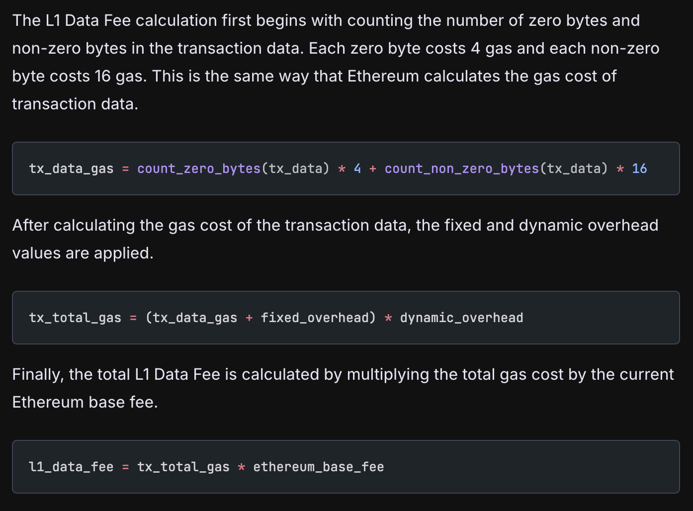
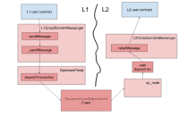

# Bruce Xu

## 自我介绍

大家好，我是 Bruce，对 OP 非常感兴趣，然后希望可以通过这次共学，系统性的理解和认识一下 Optimism 的生态和相关信息知识等。

我的推特 <https://x.com/brucexu_eth> 欢迎关注。

## 你认为你会完成本次残酷学习吗？

那必须的

## Notes

<!-- Content_START -->

### 2025.01.06

#### Layer2 扩容方案: https://docs.optimism.io/stack/rollup/overview

TODO OP Stack Specification https://specs.optimism.io/

AI：OP Stack 是一个模块化的区块链开发框架，它允许任何人部署与 Optimism 兼容的 L2 网络。它的规范文档详细说明了如何实现一个完整的 OP Chain，包括：

1. 共识机制：采用单一 sequencer 模式
2. 执行层：与以太坊 EVM 完全兼容
3. 数据可用性：数据存储在以太坊 L1 上
4. 验证系统：通过 fault proof 确保安全性
5. 跨链桥接：标准化的消息传递系统

目前 OP 的 L2 Blocks 存放在 https://etherscan.io/address/0xff00000000000000000000000000000000000010 这个地址的 blob 上面。提交之后，就无法被改变或者审查，这就是 L2 继承以太坊可用性和完整性的方式。

保存数据的时候，保存的是压缩过的数据，所以可以节约 gas，现在保存到 blob 上面，gas 更低了。

DONE Bedrock 是什么？

AI：Bedrock 是 OP Stack 的一次重大升级，于 2023 年 6 月推出。主要改进包括：

1. 重写了节点软件，提高了性能和可靠性
2. 降低了交易费用，通过优化数据压缩和批处理
3. 改进了与以太坊的兼容性，支持更多 EVM 操作码
4. 简化了系统架构，使得维护和升级更容易
5. 增强了模块化设计，便于其他项目复用代码

TODO 看一下数据压缩规则以及原始数据 https://specs.optimism.io/protocol/derivation.html#batch-submission-wire-format

AI：OP 的数据压缩主要通过以下方式实现：

1. Channel 格式：将多个交易打包成 channel
2. 压缩算法：使用 zlib 进行数据压缩
3. 批处理提交：多个 channel 组合成 batch，再提交到 L1
4. 数据编码：使用高效的二进制格式，减少存储空间
5. 去重优化：相似交易数据会被优化存储

---

OP Gas fee 的运转流程 https://docs.optimism.io/stack/transactions/fees：

- EVM 等效，类似以太坊的运行方式，但是有一些不同
- 实际 gas = L2 执行 gas + L1 数据保存费用
- L2 执行 gas 的计算规则以太坊一样，所以执行的 gas 一样，也使用 EIP-1559 设置 base fee 等。但是 gas 的价格是非常低的
- OP 进行了一些小参数调整，所以有更短的区块时间
- The eth_maxPriorityFeePerGas RPC method can be used to estimate a priority fee that will get your transaction included quickly.
- 商业模式就是赚 gas fee 的利差，自己的成本低，然后收取一定的 gas，把 L1 的 gas 成本扣掉就可以盈利了。所以交易和使用量就是最关键的指标和数据
-

L1 Data 的 gas fee 计算规则



Sequencer Fee Vault 收集和保存 OP sequencer 的 gas fee，然后用于支付 data 到 L1 的 gas fee。被 predeployed 到 0x4200000000000000000000000000000000000011 这个地址

https://optimistic.etherscan.io/address/0x4200000000000000000000000000000000000011

基本的商业模式：

- 构建一个更中心化高效的以太坊区块链，收取较低的 Gas fee，不追求去中心化的安全性
- 通过把数据定期同步保存到 L1 实现数据可用性和安全性，通过一些校验机制确保区块安全
- 实际成本在把数据同步到 L1 的 gas 消耗，所以赚取上面 gas 的利差，通过一些脚本实现自动化的数据搬运等

实现了更快更便宜的交易，同时一定程度的保证了安全性。

OP uses a simple party, sequencer to:

- Provide tx confirmation and state updates
- build L2 blocks
- submit L2 blocks to L1

In OP, generate a block every 2 seconds.

TODO OP 上面的交易通过 sequencer 来生成和决策，那么如何避免 sequencer 的作恶或者审查？下面这个叙述没看懂：Transactions submitted on L1 (called deposits) are included in the chain in the appropriate L2 block. Every L2 block is identified by the "epoch" (the L1 block to which it corresponds, which typically has happened a few minutes before the L2 block) and its serial number within that epoch. The first block of the epoch includes all the deposits that happened in the L1 block to which it corresponds. If the sequencer attempts to ignore a legitimate L1 transaction, it ends up with a state that is inconsistent with the verifiers, same as if the sequencer tried to fake the state by other means. This provides OP Mainnet with L1 Ethereum level censorship resistance. You can read more about this mechanism in the protocol specifications.

AI：OP 通过多重机制来防止 sequencer 作恶：

1. 强制包含 L1 存款交易：sequencer 必须按顺序包含所有通过 L1 提交的交易
2. 状态验证：验证者节点会验证 sequencer 提交的状态
3. Fault Proof 系统：如果 sequencer 作恶，可以通过故障证明进行惩罚
4. 去中心化计划：未来会引入去中心化 sequencer 网络
5. 社区监督：任何人都可以运行验证节点监控 sequencer 行为

~~TODO OP 目前有多少节点？~~

AI：OP 的节点网络包括：

1. 主要 Sequencer：由 OP 基金会运营的中心化节点
2. 验证节点：任何人都可以运行，目前约有数百个
3. 归档节点：存储完整历史数据的节点
4. RPC 节点：提供 API 服务的节点

TODO 具体活跃节点在哪里查看？

~~TODO OP Sequencer 在哪里运行？如果被攻击了怎么办？是一个单点风险吗？~~

AI：OP Sequencer 的运行情况：

1. 部署位置：在 AWS 云服务上运行，有多区域备份
2. 攻击应对：
   - 如果 Sequencer 被攻击，用户仍可通过 L1 提交交易
   - 基金会可以快速切换备用 Sequencer
   - 验证节点网络保证数据安全性
3. 风险缓解：
   - 正在推进 Sequencer 去中心化
   - 多重签名控制关键更新
   - 完善的灾难恢复机制

TODO OP 宣称可以 send arbitrary messages between smart contracts on L2 and L1，这样可以 transfer ETH 和 ERC20 等。跨链和 deposit 是怎么做到的？阅读 https://docs.optimism.io/builders/app-developers/bridging/standard-bridge 然后实际跨链进行分析。

TODO 包括了原生的跨链流程，还有一些 L2 的跨链服务的研究，例如 orbiter 等。L2 -> L1 的技术文档 https://specs.optimism.io/protocol/withdrawals.html

Fault proofs 故障证明（之前叫 fraud proofs 欺诈证明）

state commitments 先提交到 L1，然后等待一段时间让大家做出挑战，没有挑战就是 final，然后就可以接受 withdrawal proofs 了，进行正式的交易。

TODO 这里 PGNode or ETHPanda 可以做一个 challenger 托管一个校验节点。

It's important to note that a successful challenge does not roll back OP Mainnet itself, only the published commitments about the state of the chain. The ordering of transactions and the state of OP Mainnet is unchanged by a fault proof challenge.

AI：OP 的跨链机制包括：

1. 标准桥接：
   - L1 → L2：通过存款合约直接发送
     - TODO 怎么 mint 出来呢？
   - L2 → L1：需要等待 7 天挑战期
2. 快速桥接服务：
   - Orbiter：提供快速跨链，有一定信任假设
   - 其他第三方桥如 Hop、Across 等
     - TODO 这些桥的实现原理是什么？
3. 消息传递：
   - 支持任意消息跨链
   - 可用于复杂的跨链操作
4. 安全考虑：
   - 官方桥最安全但较慢
   - 快速桥需要权衡安全性和速度

TODO 如果不回滚 OP 的数据，那么这个 state commitment 是谁来提交的？有错误信息之后怎么处理？

AI：如果不回滚 OP 的数据，这个故障证明系统的作用是：

1. 阻止错误状态进入 L1：
   - 防止基于错误状态的提款
   - 维护资产安全性
2. 惩罚机制：
   - 可能会惩罚作恶的 Sequencer
   - 触发紧急治理机制
3. 状态同步：
   - 验证者可以重新同步到正确状态
   - 保持网络一致性
4. 用户资产安全：
   - 即使状态出错，用户资产仍然安全
   - 可以通过 L1 合约保障权益

TODO research EIP-1559

Reading

- https://docs.optimism.io/stack/transactions/deposit-flow
- https://docs.optimism.io/stack/transactions/withdrawal-flow
- https://docs.optimism.io/stack/transactions/transaction-flow
- https://docs.optimism.io/builders/chain-operators/self-hosted
- https://docs.optimism.io/builders/chain-operators/tutorials/create-l2-rollup

### 2025.01.07

## Deposit flow https://docs.optimism.io/stack/transactions/deposit-flow



这个图花的有点问题不是很容易理解，应该是 op_node 在中间，监听了 L1 的 Event 然后 relay 了这个交易到 L2。

TODO 有空系统性的研究一下跨链重新画一下吧。

L1 -> L2：

- L1 sendMessage 到合约，包括目标地址、value、data 等
- L1 合约调用 \_depositTransaction 方法，经过一些检查之后，Emit a TransactionDeposited event so that the rollup node can derive a deposit transaction for the deposit。是一个链下的行为
- L2 节点监听事件然后判断没有问题之后，relay calldata 实现 L2 上面出现资产

用 USDT 为例，大概流程就是：

1. 发送 USDT 到 L1 的 bridge 锁定合约（找了下疑似这个，不确定对不对 https://etherscan.io/address/0x99c9fc46f92e8a1c0dec1b1747d010903e884be1）
2. L1 确认无误后，触发事件
3. rollup node 拿到事件，然后检查之后，在 L2 的网络上重放 mint 出来对等的 token 到对应地址

其中系统需要保证 mint 出来的 token 是 1 比 1 对等的，如果不对，可以提交 proof 挑战，然后成功后 state 回滚，拿到奖励。

TODO L2 上面部署的对应的 token 合约是跟 L1 一样的吗？通过拿到代码或者对应的 calldata 直接部署？

TODO 分析一个实际的 native 跨链案例 https://etherscan.io/tx/0xab6ceb1c52fc7f38e034f300a00314c5203afb12275a895b219a347be74e43b5#eventlog 、 https://etherscan.io/address/0x99c9fc46f92e8a1c0dec1b1747d010903e884be1

TODO 一些视频：

- Send ERC20 between L1 and L2 | Optimism https://www.youtube.com/watch?v=yyKDin9r94g&ab_channel=SmartContractProgrammer
- Send Message from L1 to L2 | Optimism https://www.youtube.com/watch?v=SKl5pEs8reY&ab_channel=SmartContractProgrammer
- Send ETH between L1 and L2 | Optimism https://www.youtube.com/watch?v=8Rx56fj1kkM&ab_channel=SmartContractProgrammer

TODO https://ethereum.org/en/developers/tutorials/optimism-std-bridge-annotated-code/

做了一下 Replaying messages 的测试，私钥是随机生成的可以直接执行使用：

```
PRIV_KEY=d7536bb0d6a471f166056bcd400a43904b9cf9e72a676eae0eb23e5e67e797f1
export ETH_RPC_URL=https://sepolia.optimism.io
GREETER=0xEF60cF6C6D0C1c755be104843bb72CDa3D778630
cast send --private-key $PRIV_KEY $GREETER "stopChanges()"

blockHash            0x8203390c908ed52e9def882fc27b9cc94ffce38d643ffab751856b49e1e29df9
blockNumber          22205996
contractAddress
cumulativeGasUsed    712603
effectiveGasPrice    512
from                 0x6678d1F1F7429f4F344A36fbC029B9a759A59486
gasUsed              23472
logs                 []
logsBloom            0x00000000000000000000000000000000000000000000000000000000000000000000000000000000000000000000000000000000000000000000000000000000000000000000000000000000000000000000000000000000000000000000000000000000000000000000000000000000000000000000000000000000000000000000000000000000000000000000000000000000000000000000000000000000000000000000000000000000000000000000000000000000000000000000000000000000000000000000000000000000000000000000000000000000000000000000000000000000000000000000000000000000000000000000000000000000
root
status               1 (success)
transactionHash      0x94c4afbc8469d7c8cc8f15445aa06d037fc309f6367d0698df41cf42e4980691
transactionIndex     7
type                 2
blobGasPrice
blobGasUsed
authorizationList
to                   0xEF60cF6C6D0C1c755be104843bb72CDa3D778630
l1BaseFeeScalar      7600
l1BlobBaseFee        9414444
l1BlobBaseFeeScalar  862000
l1Fee                18514462025
l1GasPrice           1455833631
l1GasUsed            1600
```

```
L1_RPC=https://sepolia.optimism.io
L1XDM_ADDRESS=0x5086d1eef304eb5284a0f6720f79403b4e9be294
FUNC="sendMessage(address,bytes,uint32)"
CALLDATA=`cast calldata "setGreeting(string)" "testing"`
cast send --rpc-url $L1_RPC --private-key $PRIV_KEY $L1XDM_ADDRESS $FUNC $GREETER $CALLDATA 10000000

blockHash            0xec8d40233766aace4ac5d268ccbcd23fe6e6f753e217b417d5513b32fe9b1ae3
blockNumber          22206106
contractAddress
cumulativeGasUsed    727749
effectiveGasPrice    512
from                 0x6678d1F1F7429f4F344A36fbC029B9a759A59486
gasUsed              22544
logs                 []
logsBloom            0x00000000000000000000000000000000000000000000000000000000000000000000000000000000000000000000000000000000000000000000000000000000000000000000000000000000000000000000000000000000000000000000000000000000000000000000000000000000000000000000000000000000000000000000000000000000000000000000000000000000000000000000000000000000000000000000000000000000000000000000000000000000000000000000000000000000000000000000000000000000000000000000000000000000000000000000000000000000000000000000000000000000000000000000000000000000
root
status               1 (success)
transactionHash      0x78829a03030e0d9ea39820200b60f54cbab6b66bdb06166dac5b64d6dd5b34ea
transactionIndex     11
type                 2
blobGasPrice
blobGasUsed
authorizationList
to                   0x5086d1eEF304eb5284A0f6720f79403b4e9bE294
l1BaseFeeScalar      7600
l1BlobBaseFee        6876824
l1BlobBaseFeeScalar  862000
l1Fee                29477143471
l1GasPrice           1844191975
l1GasUsed            2048
```

TODO 这个步骤失效了，文档上的链接，看不到实际的 internal failed txs The next step is to find the hash of the failed relay. The easiest way to do this is to look in the internal transactions of the destination contract, and select the latest one that appears as a failure. It should be a call to L2CrossDomainMessenger at address 0x420...007. This is the call you need to replay. 提交了一个 PR 进行反馈：https://github.com/ethereum-optimism/docs/issues/1226。

<!-- Content_END -->
