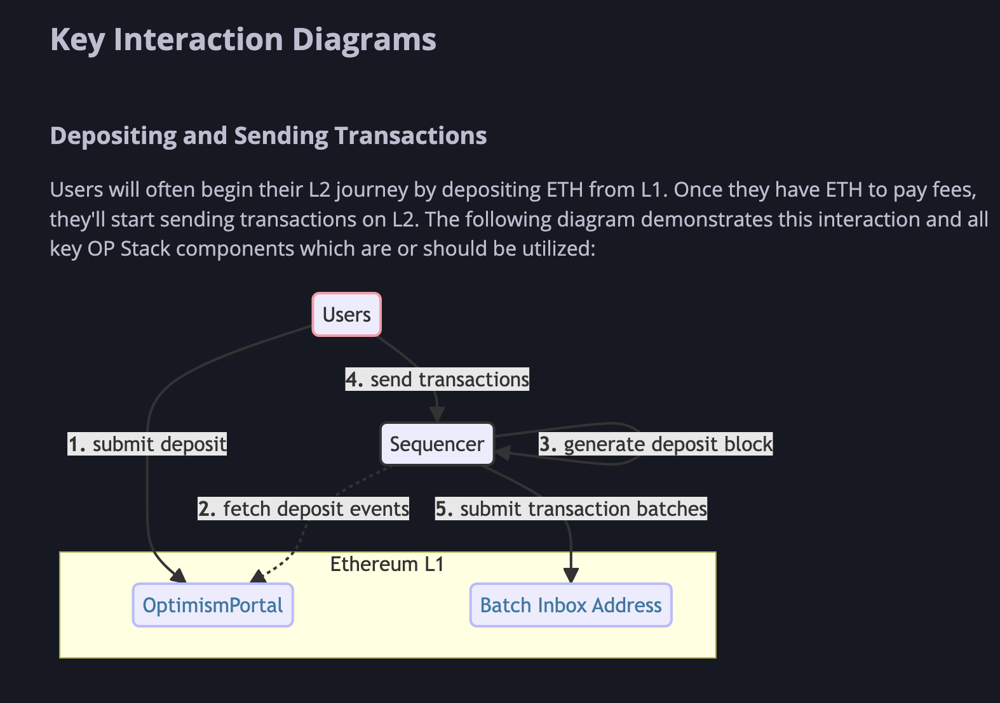

> 请在上边的 timezone 添加你的当地时区，这会有助于你的打卡状态的自动化更新，如果没有添加，默认为北京时间 UTC+8 时区
> 时区请参考以下列表，请移除 # 以后的内容

timezone: Asia/Shanghai

---

# {Harris Lee}

1. 自我介绍

大家好，我是Harris Lee，一位对OP Layer 2的发展感兴趣的教师，希望可以学习并传播ETH&OP 生态
2. 你认为你会完成本次残酷学习吗？

我为什么要认为不会呢？肯定是会的，希望最后能学下来并传播推广

## Notes

<!-- Content_START -->

### 2025.01.01

笔记内容

测试一下PR
### 2025.01.02

### 2025.01.06

笔记内容：
今天学习的内容是Optimism的overview
Firstly, Optimism is a Layer 2 scaling solution for Ethereum. The idea of Optimism rollups is to create a new type of blockchain that allows for faster transactions and lower fees than traditional Ethereum, which is using EIP-4844 blobs.

Secondly, Optimism block production is managed by the sequencer. The sequencer will provide the following services:
1. Providing transaction confirmations and state updates
2. Constructing and executing L2 blocks
3. Submitting user transcations to L1

The sequencer does have a mempool, similar to Ethereum.

Transactions get to the sequencer in two ways: 
1. Transactions submitted directly to the sequencer. But these transactions cannot be made censorship-resistant since only the sequencer knows them
2. Transcations deposit to L1, which are included in the chain in the apporpriate L2 block. It provides OP mainnet with L1 Ethereum-level censorship resistance. For the moment, The Optimism Foundation runs the only block producer on OP mainnet.

Block execution receives blocks using two mechanisms:

1.The execution engine can update itself using peer to peer network with other execution engines.
2.rollup node derives the L2 blocks from L1.

OP also could be thinking as bridging ETH or tokens between layers

OP is designed for users sending arbitrary messages between smart contracts on L2 and the underlying L1

Moving from Ethereum to OP mainnet called "deposit", meanwhile, moving from OP mainnet to Ethereum called "withdrawal"

Fault proofs:

When a state commitment is challenged, the commitment can  be invalidated through a "fault-proof" process. This process wil replace the invalidated state commitment with a new one. A successful challenge does not roll back OP Mainnet itself, only the published commitments about the state of the chain. The order of transactions and the state of Op mainnet is unchanged by a fault-proof challenge.

### 2025.01.07

According to yesterday's learning notes, I will start to learn about Optimism's rollup architecture. Today will start to learn about EVM Equivalence,the sequencers and messager and the rollup node  with https://specs.optimism.io/protocol/messengers.html\

EVM Equivalence:

The EVM Equivalence is the core concept of Optimism. It is a set of rules that allow the execution of Ethereum smart contracts on Optimism. The EVM Equivalence is a set of rules that allow the execution of Ethereum smart contracts on Optimism. The EVM Equivalence is a set of rules that allow the execution of Ethereum smart contracts on Optimism.

With a readable word to describe the functionality of Ethereum for Optimism,  If you think of Ethereum as an almighty, decentralized court, then the core insight of L2 scalability is: “don’t go to court to cash a check — just go if the check bounces.”--To translate this saying in Chinese it could said:不要为了兑现支票而去法院——只有在支票跳票时才去。
具体解释上面这句话可以理解为：

以太坊作为“全能的、去中心化的法院”：这里指的是以太坊作为一个基础区块链平台，它提供了安全、不可篡改的交易记录，并能够执行智能合约。就像法院一样，以太坊确保所有规则都被正确遵循，所有的争议都能得到公正的解决。然而，就像现实中的法院，以太坊处理每一笔交易或争议的成本（Gas费用）较高，而且处理速度相对较慢，因为每个区块都需要网络中的大多数节点进行验证和共识。

“不要为了兑现支票而去法院”：这表示不是每一个操作或交易都需要直接在以太坊主链上进行。许多日常的小额交易或快速交互可以通过更高效的方式完成，而不必占用以太坊主链的资源。这就是二层扩展方案的作用，它们允许用户在不依赖于以太坊主链的情况下进行大量的交易和互动，从而提高了效率并降低了成本。

“只有在支票跳票时才去”：如果在L2系统中出现了问题，比如资金没有按照预期转移，或者发生了欺诈行为，这时用户可以回到以太坊主链（“法院”）来解决争议。以太坊主链的安全性和最终性保证了即使L2出现问题，用户的资产仍然是安全的，并且可以恢复到正确状态。

According to the elaboration of the saying, we could easily understand EVM Equivalence as a set of rules that allow the execution of Ethereum smart contracts on Optimism with technique rollup architecture which could provide two outstanding features:
1. uncensorable transactions
2. anybody can transact

The Value of uncensorable transactions for rollup could be explained as follows:

The concept of "uncensorable" in the context of Ethereum Virtual Machine (EVM) Equivalence refers to the characteristic of the Ethereum network that, once a transaction is broadcasted to the network and successfully included in a block, the outcome of the transaction and the state updates are not subject to censorship or reversal. This implies:

Unstoppable Transactions: Any user can initiate transactions as long as they adhere to the protocol rules of Ethereum (e.g., paying sufficient Gas fees), and these transactions cannot be prevented from entering the blockchain due to external intervention.

Immutable History: Once a transaction is included in a block that the consensus mechanism has confirmed, it becomes part of the immutable history of the blockchain. This history is considered permanent and unchangeable unless more than 50% of the network's hash power is controlled to perform what is known as a 51% attack, which is extremely difficult and costly.

Decentralized Nature: Ethereum is a decentralized platform, so no single entity can decide which transactions should be accepted or rejected. All nodes collectively maintain the security and integrity of the network, ensuring that each user's rights are not infringed upon.
Execution of Smart Contracts: Once smart contracts are deployed and executed automatically under specific conditions, their outcomes also cannot be blocked or reversed, unless the contract itself is coded with specific clauses allowing for such actions. This ensures that agreements between parties can reliably execute according to predefined rules.

In summary, "uncensorable" underscores one of the core values provided by Ethereum as a blockchain technology — offering an open, transparent, and trustless environment where information and value exchanges can occur freely without interference. This attribute is crucial for protecting user privacy, safeguarding freedom of speech, and building censorship-resistant applications.

To satisfy the requirements of Ethereum L1 & L2s infrastructure, Optimistic comes with OVM and is targeted to be an EVM equivalence. If L2s want to surf Ethereum’s wave of infrastructural network effects, they must become EVM equivalent.

Optimistic practice EVM equivalence by achieving L2 blocks executed with precise EVM equivalence. Instead of implementing the EVM in Solidity, implement a VM with a much smaller, simpler instruction set, and run the EVM within this VM during fraud proofs. To do this, we must simply compile an existing EVM interpreter, such as Seth’s, to run within the simpler VM.

next day plan: focusing on sequencers, users, messages role in Optimistic protocol stack and step into the next step of Optimistic protocol.

### 2025.01.07

According to yesterday learning notes, I will start to learn about the Optimism's rollup architecture. Today will start to learn about EVM Equivalence,the sequencers and messager and the rollup node  with https://specs.optimism.io/protocol/messengers.html\

EVM Equivalence:

The EVM Equivalence is the core concept of Optimism. It is a set of rules that allow the execution of Ethereum smart contracts on Optimism. The EVM Equivalence is a set of rules that allow the execution of Ethereum smart contracts on Optimism. The EVM Equivalence is a set of rules that allow the execution of Ethereum smart contracts on Optimism.

With a readable word to describe the functionality of Ethereum for Optimism,  If you think of Ethereum as an almighty, decentralized court, then the core insight of L2 scalability is: “don’t go to court to cash a check — just go if the check bounces.”--To translate this saying in Chinese it could said:不要为了兑现支票而去法院——只有在支票跳票时才去。
具体解释上面这句话可以理解为：

以太坊作为“全能的、去中心化的法院”：这里指的是以太坊作为一个基础区块链平台，它提供了安全、不可篡改的交易记录，并能够执行智能合约。就像法院一样，以太坊确保所有规则都被正确遵循，所有的争议都能得到公正的解决。然而，就像现实中的法院，以太坊处理每一笔交易或争议的成本（Gas费用）较高，而且处理速度相对较慢，因为每个区块都需要网络中的大多数节点进行验证和共识。

“不要为了兑现支票而去法院”：这表示不是每一个操作或交易都需要直接在以太坊主链上进行。许多日常的小额交易或快速交互可以通过更高效的方式完成，而不必占用以太坊主链的资源。这就是二层扩展方案的作用，它们允许用户在不依赖于以太坊主链的情况下进行大量的交易和互动，从而提高了效率并降低了成本。

“只有在支票跳票时才去”：如果在L2系统中出现了问题，比如资金没有按照预期转移，或者发生了欺诈行为，这时用户可以回到以太坊主链（“法院”）来解决争议。以太坊主链的安全性和最终性保证了即使L2出现问题，用户的资产仍然是安全的，并且可以恢复到正确状态。

According to the elaboration of the saying, we could easily understand the EVM Equivalence as a set of rules that allow the execution of Ethereum smart contracts on Optimism with technique rollup architecturem which could provide two outstanding features:
1. uncensorable transactions
2. anybody can transcat

The Value of uncensorable transactions for rollup could be explained as following:

The concept of "uncensorable" in the context of Ethereum Virtual Machine (EVM) Equivalence refers to the characteristic of the Ethereum network that, once a transaction is broadcasted to the network and successfully included in a block, the outcome of the transaction and the state updates are not subject to censorship or reversal. This implies:

Unstoppable Transactions: Any user can initiate transactions as long as they adhere to the protocol rules of Ethereum (e.g., paying sufficient Gas fees), and these transactions cannot be prevented from entering the blockchain due to external intervention.

Immutable History: Once a transaction is included in a block that has been confirmed by the consensus mechanism, it becomes part of the immutable history of the blockchain. This history is considered permanent and unchangeable, unless more than 50% of the network's hash power is controlled to perform what is known as a 51% attack, which is extremely difficult and costly.

Decentralized Nature: Because Ethereum is a decentralized platform, no single entity can decide which transactions should be accepted or rejected. All nodes collectively maintain the security and integrity of the network, ensuring that each user's rights are not infringed upon.
Execution of Smart Contracts: Once smart contracts are deployed and execute automatically under specific conditions, their outcomes also cannot be blocked or reversed, unless the contract itself is coded with specific clauses allowing for such actions. This ensures that agreements between parties can reliably execute according to predefined rules.

In summary, "uncensorable" underscores one of the core values provided by Ethereum as a blockchain technology — offering an open, transparent, and trustless environment where information and value exchanges can occur freely without interference. This attribute is crucial for protecting user privacy, safeguarding freedom of speech, and building censorship-resistant applications.

In order to satisfy the requriement of Ethereum L1 & L2s infrastructure, Optimistic comes with OVM and targeting to be an EVM equivalence. If L2s want to surf Ethereum’s wave of infrastructural network effects, they must become EVM equivalent.

Optimisistc practice EVM equivalence by achieving L2 blocks executed with precise EVM equivalence. Instead of implementing the EVM in Solidity, implement a VM with a much smaller, simpler instruction set, and run the EVM within this VM during fraud proofs. To do this, we must simply compile an existing EVM interpreter, such as geth’s, to run within the simpler VM.

next day plan: focusing on sequencers, users, messages role in Optimistic protocol stack and step into the next step of Optimistic protocol.

### 2025.01.08

今天的学习内容将聚焦于sequencers，users, messagers在Optimistic协议栈中的角色，以及进入Optimistic协议的下一步。

user has two majority activities: submit transaction and query transaction.

user submits transaction to interact with Ethereum through a sequencer
user query transaction from the interfaces operated by the verifier

according to the above two activites, we need to about two roles: sequencers and verifiers

sequencers fill the role as block producers. In conclusion, sequencers will have these five activities:
1.Accepts transactions directly from Users.
2.Observes "deposit" transactions generated on Ethereum.
3.Consolidates both transaction streams into ordered L2 blocks.
4.Submits information to L1 that is sufficient to reproduce those L2 blocks fully.
5.Provides real-time access to pending L2 blocks that have not yet been confirmed on L1.

One thing needs to be noted that the sequencers are not trusted actors but are responsible for improving the user experience by ordering transactions much more quickly and cheaply than would currently be possible if users were to submit all transactions directly to L1.

Verifier fills the downloading role and executes the L2 state transition function independently of the Sequencer.

The depositing and sending transaction will have 5 steps:

1.Submit Deposit: Users initiate the process by submitting a deposit from Ethereum Layer 1 (L1) to the L2 network.
2.Fetch Deposit Events: The Sequencer  fetches deposit events from Ethereum L1 by OptimismPortal. This step ensures that the L2 network is aware of the deposits made on L1.
3.Generate Deposit Block: The Sequencer generates a deposit block based on the fetched deposit events. This block contains information about the deposits and is used to update the state of the L2 network.
4.Send Transactions: Users can start sending transactions on the L2 network once they have deposited ETH to pay fees. These transactions are processed more efficiently than on L1 due to the nature of L2 solutions.
5.Submit Transaction Batches: The Sequencer submits transaction batches to the Batch Inbox Address on Ethereum L1. This step involves bundling multiple transactions into a single batch, which is then submitted to L1 for finality.

The withdrawal process is similar to the deposit process, but instead of sending ETH to the L2 network, users withdraw their funds from the L2 network to Ethereum L1. The withdrawal could be simply identified as: **Users withdraw ETH or ERC20 tokens from an OP Stack chain back to Ethereum.**

1.Send Withdrawal Initialization Transaction: Users initiate the withdrawal process by sending a transaction to start the withdrawal on L2.
2.Submit Transaction Batch: The Sequencer submits a batch of transactions, including the withdrawal initialization, to the Batch Inbox Address on Ethereum L1.
3.Submit Output Proposal: Proposers submit an output proposal to the DisputeGameFactory contract on L2.
4.Generate Game: The DisputeGameFactory generates a game based on the output proposal and sends it to the FaultDisputeGame contract.
5.Submit Withdrawal Proof: Users submit proof of the withdrawal to the OptimismPortal contract on L2.
6.Wait for Finalization: The system waits for the finalization of the withdrawal process.
7.Submit Withdrawal Finalization: Users submit the finalization of the withdrawal to the OptimismPortal contract.
8.Check Game Validity: The OptimismPortal checks the validity of the game generated by the FaultDisputeGame contract.
9.Execute Withdrawal Transaction: Once the game is validated, OptimismPortal executes the withdrawal transaction to transfer the funds to external contracts on Ethereum L1.

next day(2025.01.09) will learn about some new words/roles: Proposers, Game and OptimismPortal.

### 2025.01.09

Today's plan to take away the new words/roles: Proposers, Game and OptimismPortal.

为了理解Proposers, 我们需要认识到Proposers在L2网络中角色所在的意义，以及Proposers在L2网络中如何与L1网络进行交互。

Proposers:

After processing one or more blocks the outputs will need to be synchronized with the settlement layer (L1) for trustless execution of L2-to-L1 messaging, such as withdrawals. These output proposals act as the bridge's view into the L2 state. **Actors called "Proposers" submit the output roots to the settlement layer (L1) and can be contested with a fault proof, with a bond at stake if the proof is wrong.**

The proposer's role is to construct and submit output roots, which are commitments to the L2's state. To practice these submission operation, proposers will post through contract L2OutputOracle on L1. The L2OutputOracle contract is responsible for submitting output roots to the L1. 

repo for optimism L2 proposers code: https://github.com/ethereum-optimism/optimism/tree/d48b45954c381f75a13e61312da68d84e9b41418/op-proposer

L2 blocks are produced at a constant rate of L2_BLOCK_TIME (2 seconds). A new L2 output MUST be appended to the chain once per SUBMISSION_INTERVAL which is based on a number of blocks. The exact number is yet to be determined, and will depend on the design of the fault proving game.

OptimismPortal:

The OptimismPortal is a low-level contract responsible for passing messages between L1 and L2. Messages sent directly to the OptimismPortal have no form of replayability. Users are encouraged to use the L1CrossDomainMessenger for a higher-level interface.

Next day(2025.01.10) will step into comparison between OP and other rollup proposals.

### 2025.01.10

Layer 2 rollup的四种技术方案：Optimistic Rollup、ZK Rollup、Plasma、Validium

https://learnblockchain.cn/article/3703

以下是计算gas费用降低的具体事例：
普通转账eth需要字节数112左右，ZK压缩为12个字节，op系压缩为78.4（不固定，假设压缩了30%的空间），假设swap转账需要字节数约180左右，ZK压缩为14个字节，op系压缩为126个字节。

在现有的以太坊链上，gas 上限为 3000 万，交易中每个非0字节的calldata数据需要 16 个 gas，0字节需要4个gas。如果ZK占领了以太坊所有的区块空间（在证明验证上花费 500k gas），忽略0字节的数量。

那么该批次可以有（2950 万 / 16）= 1,843,750 字节的数据。如上所示，每次用户操作的 ETH 转账汇总只需要 12 个字节，这意味着该批次最多可以包含 153,645笔交易。在13 秒的平均出块时间下，这转化为 ~11,818 TPS（相比之下，直接在以太坊本身上传输的 ETH 传输为 1300 万 / 21000 / 13 ~= 101 TPS）。

由上可知ZK Rollup 转账eth的可扩展性提高了100 + 倍，而zk最大优势不在于转账eth，相比转账erc20的合约代币，与uniswap交易来算，主网消耗的gaslimit的更多，ZK Rollup 压缩的性价比也越高，ZK Rollup相比主网的uniswap交易拓展可提高400+倍。

计算其他如OP的rollup机制，也可以参考上述的计算方法

以上rollup的机制主要聚焦于两个以太坊社区的提案：EIP-4488、EIP-4844

其中EIP-4488针对的是L1的calldata费用过高的问题,于2021年末提出，它实现了压缩calldata的功能，压缩后calldata的gas费用降低，从而提高交易效率。
具体包括：
1.降低Calldata Gas费用：EIP-4488提议将每字节calldata的gas费用从16 gas显著降低到3 gas。
2.引入最大Calldata限制：为了防止滥用和网络拥堵，该提案还建议对每个区块内可包含的calldata总量设置上限，即约1MB（具体数值可能会根据实际情况调整），这样可以避免因为过低的费用导致的数据膨胀问题。

EIP-4844 是一个更为复杂的提案，旨在为以太坊带来一种新的交易类型，这种交易可以携带额外的数据块(blob)，用于支持Rollup技术而无需立即进行全面的分片升级，于2023年提出
具体内容包括：
1.携带Blob的交易：EIP-4844引入了一种新的交易格式，允许交易附带所谓的“blobs”。Blobs是大型、临时存储的数据块，专门设计用于满足Rollup的数据可用性需求。
2.独立Gas价格和限制：与calldata不同，blob有自己的gas价格和限制，并且其定价模型更注重长期维护成本而非短期使用成本。
3.数据生命周期管理：Blobs只会在共识层节点中保留一段时间（例如几周），之后会被删除，这与传统的永久存储机制形成对比，减少了长期存储的压力。
4.通往完全Danksharding的桥梁：虽然EIP-4844本身不是完整的分片实现，但它为未来的完全分片（Danksharding）铺平了道路，提供了一个逐步过渡的方法。

next day 2025.01.11 will learn about stages from https://medium.com/l2beat/introducing-stages-a-framework-to-evaluate-rollups-maturity-d290bb22befe

### 2025.01.11

According to the Vitalik’s proposed milestones, Ethereum rollup could be divided into 3 stages which having different assistance from centralized control, as known as, training wheels of rollup:
1.stage 0:Full Training Wheels: At this stage, the rollup is effectively run by the operators. All data and operation relay on the L1.

2.stage 1:Limited Training Wheels: At this stage, the rollup is run by smart contracts. However, a Security Council might remain in place to address potential bugs. The Security Council, comprised of a diverse set of participants, provides a safety net, but its power also poses a potential risk.

3.stage 2:No Training Wheels: This is the final stage where the rollup becomes fully managed by smart contracts. At this point, the fraud proof system is permissionless, and users are given ample time to exit in the event of unwanted upgrades. The Security Council’s role is strictly confined to addressing soundness errors that can be adjudicated on-chain, and users are protected from governance attacks.

The stages idea comes from Vitalik's blog and many discussion in the community to define the rollup boundaries, such as the minimum exit window, the Security Council thresholds, and fraud proof allowlist size.

Each stage's requirement could be describe into several questions:
For stage 0: we need to think about these 4 questions:
- Does the project call itself a rollup?
- Are L2 state roots posted on L1?
- Does the project provide Data Availability (DA) on L1
- Is software capable of reconstructing the rollup’s state source available?

For stage 1: we need to think about these 5 questions:
- Does the project use a proper proof system?
- Are there at least 5 external actors that can submit a fraud proof?
- Can the users exit without the operator’s coordination?
- Do users have at least 7 days to exit in case of unwanted upgrades (Security Council and governance excluded)?
- Is the Security Council properly set up?

For stage 2:
- Is the fraud proof system permissionless?
- Do users have at least 30 days to exit in case of unwanted upgrades?
- Is the Security Council restricted to act only due to errors detected on chain?

next day 2025.01.12 will learn about rollup's and Optimism's protocal

### 2025.01.12

Today‘s work will learn through  https://specs.optimism.io/protocol/overview.html

对于Layer 2的总体架构来说，需要根据Layer 1的情况去诠释它的意义
在Execution-level实现等效以太坊虚拟机，要求有：
1.不需要特殊的编译器运行
2.无意外的gas费用
3.交易跟踪不需要额外的配置
4.所有以太坊的工具和特性均可使用
在此基础上，所有的节点要兼容以太坊layer 1，并且L2的实现要尽可能地减小和vanila Geth node的差异，并且充分利用L1的特性

首先，这个L2区块链将与一个基本的Geth节点交互，并尽可能地利用现有的第一层（L1）标准。这意味着该L2链将在某些方面遵循以太坊协议规范，以便更好地与其他以太坊节点通信。

其次，执行引擎/rollup节点将使用ETH2引擎API来构建主链上的L2链。ETH2引擎是以太坊2.0的核心组件之一，用于处理网络中的所有交易和状态更新。通过使用ETH2引擎API，L2链可以更好地集成到以太坊网络中，并获得更好的性能和安全性。

最后，执行引擎还将利用Geth节点现有的内存池和同步实现，包括快照同步。内存池是保存待确认交易的地方，而同步则是指将新的区块添加到本地区块链中。通过利用这些现有功能，L2链可以更快地处理交易并保持与主链的一致性。

Geth是一个用Go语言编写的以太坊客户端，可以用来连接或创建私有的以太坊网络，而关于L2链的部署，Geth提供的是基础支持，具体实施依赖于额外的协议和工具。

next day 2025.01.13 will learn about Core L1 Smart Contracts

<!-- Content_END -->
